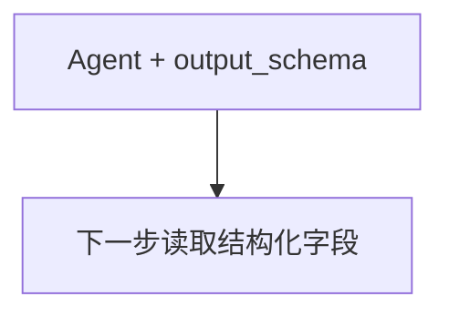

# structured_io_agent.py — 实现原理分析

<!-- cookbook-py-source:start -->
## 完整源码

```python
"""
Structured IO Agent
===================

Demonstrates structured output schemas at each agent step in a multi-step workflow.
"""

from typing import List

from agno.agent import Agent
from agno.models.openai import OpenAIChat
from agno.tools.hackernews import HackerNewsTools
from agno.tools.websearch import WebSearchTools
from agno.workflow.step import Step
from agno.workflow.workflow import Workflow
from pydantic import BaseModel, Field


# ---------------------------------------------------------------------------
# Define Structured Models
# ---------------------------------------------------------------------------
class ResearchFindings(BaseModel):
    topic: str = Field(description="The research topic")
    key_insights: List[str] = Field(description="Main insights discovered", min_items=3)
    trending_technologies: List[str] = Field(
        description="Technologies that are trending",
        min_items=2,
    )
    market_impact: str = Field(description="Potential market impact analysis")
    sources_count: int = Field(description="Number of sources researched")
    confidence_score: float = Field(
        description="Confidence in findings (0.0-1.0)",
        ge=0.0,
        le=1.0,
    )


class ContentStrategy(BaseModel):
    target_audience: str = Field(description="Primary target audience")
    content_pillars: List[str] = Field(description="Main content themes", min_items=3)
    posting_schedule: List[str] = Field(description="Recommended posting schedule")
    key_messages: List[str] = Field(
        description="Core messages to communicate",
        min_items=3,
    )
    hashtags: List[str] = Field(description="Recommended hashtags", min_items=5)
    engagement_tactics: List[str] = Field(
        description="Ways to increase engagement",
        min_items=2,
    )


class FinalContentPlan(BaseModel):
    campaign_name: str = Field(description="Name for the content campaign")
    content_calendar: List[str] = Field(
        description="Specific content pieces planned",
        min_items=6,
    )
    success_metrics: List[str] = Field(
        description="How to measure success",
        min_items=3,
    )
    budget_estimate: str = Field(description="Estimated budget range")
    timeline: str = Field(description="Implementation timeline")
    risk_factors: List[str] = Field(
        description="Potential risks and mitigation",
        min_items=2,
    )


# ---------------------------------------------------------------------------
# Create Agents
# ---------------------------------------------------------------------------
research_agent = Agent(
    name="AI Research Specialist",
    model=OpenAIChat(id="gpt-4o-mini"),
    tools=[HackerNewsTools(), WebSearchTools()],
    role="Research AI trends and extract structured insights",
    output_schema=ResearchFindings,
    instructions=[
        "Research the given topic thoroughly using available tools",
        "Provide structured findings with confidence scores",
        "Focus on recent developments and market trends",
        "Make sure to structure your response according to the ResearchFindings model",
    ],
)

strategy_agent = Agent(
    name="Content Strategy Expert",
    model=OpenAIChat(id="gpt-4o-mini"),
    role="Create content strategies based on research findings",
    output_schema=ContentStrategy,
    instructions=[
        "Analyze the research findings provided from the previous step",
        "Create a comprehensive content strategy based on the structured research data",
        "Focus on audience engagement and brand building",
        "Structure your response according to the ContentStrategy model",
    ],
)

planning_agent = Agent(
    name="Content Planning Specialist",
    model=OpenAIChat(id="gpt-4o"),
    role="Create detailed content plans and calendars",
    output_schema=FinalContentPlan,
    instructions=[
        "Use the content strategy from the previous step to create a detailed implementation plan",
        "Include specific timelines and success metrics",
        "Consider budget and resource constraints",
        "Structure your response according to the FinalContentPlan model",
    ],
)

# ---------------------------------------------------------------------------
# Define Steps
# ---------------------------------------------------------------------------
research_step = Step(
    name="research_insights",
    agent=research_agent,
)

strategy_step = Step(
    name="content_strategy",
    agent=strategy_agent,
)

planning_step = Step(
    name="final_planning",
    agent=planning_agent,
)

# ---------------------------------------------------------------------------
# Create Workflow
# ---------------------------------------------------------------------------
structured_workflow = Workflow(
    name="Structured Content Creation Pipeline",
    description="AI-powered content creation with structured data flow",
    steps=[research_step, strategy_step, planning_step],
)

# ---------------------------------------------------------------------------
# Run Workflow
# ---------------------------------------------------------------------------
if __name__ == "__main__":
    print("=== Testing Structured Output Flow Between Steps ===")
    input_text = "Latest developments in artificial intelligence and machine learning"

    # Sync
    structured_workflow.print_response(input=input_text)

    # Sync Streaming
    structured_workflow.print_response(
        input=input_text,
        stream=True,
    )
```

<!-- cookbook-py-source:end -->

> 源文件：`cookbook/04_workflows/06_advanced_concepts/structured_io/structured_io_agent.py`

## 概述

本示例展示 **各 Step 的 Agent 使用 `output_schema`（Pydantic）** 产生结构化中间结果，便于后续步解析字段而非自由文本。

**核心配置一览：**

| 配置项 | 说明 |
|--------|------|
| 多个 `Agent(..., output_schema=...)` | 链式结构化 |
| `Step` | 顺序连接 |

## 运行机制与因果链

`Agent.run` 在 schema 下返回解析后的对象，工作流将其写入 `StepOutput` 供 `StepInput` 消费。

## Mermaid 流程图


```mermaid
flowchart TD
    A1["Agent + output_schema"] --> A2["下一步读取结构化字段"]
```

## 关键源码文件索引

| 文件 | 作用 |
|------|------|
| `agno/agent/agent.py` | `output_schema` |
| `agno/workflow/step.py` | 传递 `StepOutput` |
