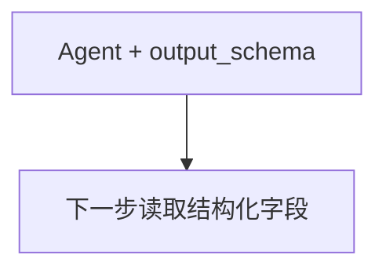

# structured_io_agent.py — 实现原理分析

> 源文件：`cookbook/04_workflows/06_advanced_concepts/structured_io/structured_io_agent.py`

## 概述

本示例展示 **各 Step 的 Agent 使用 `output_schema`（Pydantic）** 产生结构化中间结果，便于后续步解析字段而非自由文本。

**核心配置一览：**

| 配置项 | 说明 |
|--------|------|
| 多个 `Agent(..., output_schema=...)` | 链式结构化 |
| `Step` | 顺序连接 |

## 运行机制与因果链

`Agent.run` 在 schema 下返回解析后的对象，工作流将其写入 `StepOutput` 供 `StepInput` 消费。

## Mermaid 流程图

```mermaid
flowchart TD
    A1["Agent + output_schema"] --> A2["下一步读取结构化字段"]
```

## 关键源码文件索引

| 文件 | 作用 |
|------|------|
| `agno/agent/agent.py` | `output_schema` |
| `agno/workflow/step.py` | 传递 `StepOutput` |
