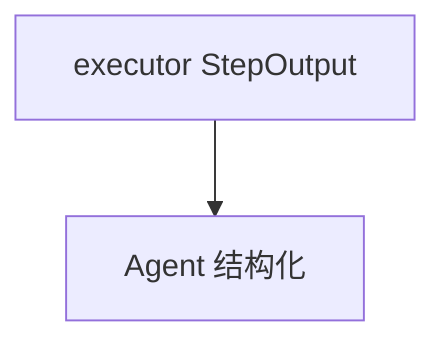

# structured_io_function.py — 实现原理分析

> 源文件：`cookbook/04_workflows/06_advanced_concepts/structured_io/structured_io_function.py`

## 概述

本示例展示 **函数 Step 返回结构化 `StepOutput`**（或序列化为 JSON 字符串）与 Agent 结构化输出混排，用于 ETL 型管线。

## 运行机制与因果链

函数步无 LLM；可解析上一步结构化内容并输出固定 schema 字符串供下一步 `output_schema` 或正则解析。

## Mermaid 流程图

## 关键源码文件索引

| 文件 | 作用 |
|------|------|
| `agno/workflow/types.py` | `StepOutput` |
