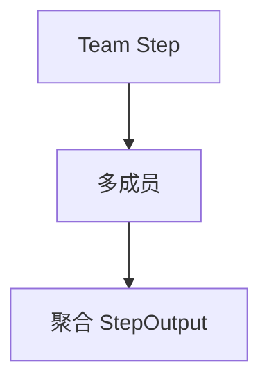

# structured_io_team.py — 实现原理分析

> 源文件：`cookbook/04_workflows/06_advanced_concepts/structured_io/structured_io_team.py`

## 概述

本示例展示 **`Team` 作为 Step 执行器** 时的结构化输入输出：多成员协作产出可被后续步消费的聚合结果。

## 运行机制与因果链

`Team.run` 输出包装在 `StepOutput`；若 Team 级或成员级设置 `output_schema`，行为与单 Agent 类似。

## Mermaid 流程图

## 关键源码文件索引

| 文件 | 作用 |
|------|------|
| `agno/team/team.py` | `Team` |
| `agno/workflow/step.py` | `team=` 参数 |
