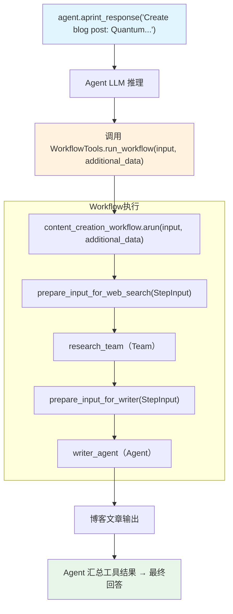

# workflow_tools.py — 实现原理分析

> 源文件：`cookbook/04_workflows/06_advanced_concepts/tools/workflow_tools.py`

## 概述

本示例展示 Agno **`WorkflowTools` — 将 Workflow 封装为 Agent 工具**机制：通过 `WorkflowTools(workflow=...)` 将整个 Workflow 包装为可被 Agent 调用的工具，外部 Agent 通过 LLM 决策动态调用 Workflow，实现 Workflow 作为 Agent 能力的扩展。

**核心配置一览：**

| 配置项 | 值 | 说明 |
|--------|------|------|
| `WorkflowTools(workflow=wf)` | 包装 Workflow | 转为 Agent 工具 |
| `add_few_shot=True` | 注入 Few-Shot 示例 | 引导 LLM 正确调用 |
| `few_shot_examples` | 调用示例文本 | 说明 `additional_data` 使用方式 |
| `async_mode=True` | 异步执行模式 | Agent 异步调用 Workflow |

## 核心组件解析

### WorkflowTools 封装

```python
from agno.tools.workflow import WorkflowTools

workflow_tools = WorkflowTools(
    workflow=content_creation_workflow,
    add_few_shot=True,
    few_shot_examples=FEW_SHOT_EXAMPLES,  # 引导 LLM 正确传递 additional_data
    async_mode=True,                       # 启用异步执行
)

agent = Agent(
    model=OpenAIChat(id="gpt-5-mini"),
    tools=[workflow_tools],  # Workflow 成为 Agent 的一个工具
    markdown=True,
)
```

### Few-Shot 示例引导

```python
FEW_SHOT_EXAMPLES = dedent("""\
    You can refer to the examples below as guidance for how to use each tool.
    ### Examples
    #### Example: Blog Post Workflow
    User: Please create a blog post on the topic: AI Trends in 2024
    Run: input_data="AI trends in 2024", additional_data={"topic": "AI, AI agents", "style": "easy to understand"}
    Final Answer: I've created a blog post...
""")
```

### Agent 调用方式

```python
# Agent LLM 决策调用 run_workflow 工具
await agent.aprint_response(
    "Create a blog post: Quantum Computing in 2025",
    instructions="When running the workflow, pass `additional_data` as a dict.",
    stream=True,
)
```

Agent 内部工具调用：
```
run_workflow(
    input_data="Quantum Computing in 2025",
    additional_data={"topic": "Quantum Computing", "style": "technical"}
)
```

### 底层 Workflow 步骤使用 additional_data

```python
def prepare_input_for_web_search(step_input: StepInput) -> StepOutput:
    topic = step_input.additional_data.get("topic")  # 从 WorkflowTools 传入
    return StepOutput(content=f"Search about: {topic}")
```

## 架构对比

| 模式 | 说明 |
|------|------|
| 直接调用 | `workflow.run(input=...)` |
| WorkflowTools | `Agent` 通过 LLM 决策调用 `run_workflow` 工具 |
| 适用场景 | Agent 需要动态决定何时执行 Workflow |

## Mermaid 流程图



## 关键源码文件索引

| 文件 | 关键类/函数 | 作用 |
|------|------------|------|
| `agno/tools/workflow.py` | `WorkflowTools` | 将 Workflow 包装为 Agent 工具 |
| `agno/workflow/workflow.py` | `Workflow.arun()` | WorkflowTools 内部异步调用 |
