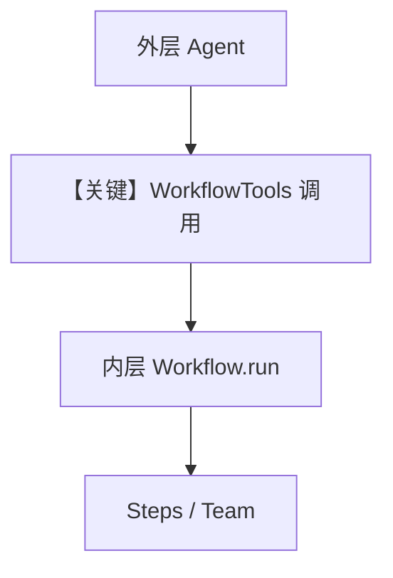

# workflow_tools.py — 实现原理分析

> 源文件：`cookbook/04_workflows/06_advanced_concepts/tools/workflow_tools.py`

## 概述

本示例展示 **`WorkflowTools` 将工作流封装为工具**，供外层 `Agent`/`Team` 在对话中 `run_workflow` 式调用；内含多步准备函数、`Team` 研究、以及 `FEW_SHOT_EXAMPLES` 教模型如何传 `additional_data`（`L24-35`）。

**核心配置一览：**

| 配置项 | 说明 |
|--------|------|
| `WorkflowTools(workflow=...)` | 把下方定义的 `Workflow` 暴露为工具 |
| 内层 `Workflow` | Web/HN 准备步 + Writer 等（见文件后半） |
| `SqliteDb` | 典型 `tmp/...db` |

## 核心组件解析

外层编排 Agent 调用工具 → 内部 `workflow.run` / `print_response` 执行管线；`prepare_input_for_web_search` 从 `additional_data["topic"]` 拼查询（`L64-77`）。

### 运行机制与因果链

**数据路径**：主 Agent user 消息 → tool 调用带 `input_data`/`additional_data` → 子工作流逐步执行 → 结果返回主 Agent。

## System Prompt 组装

- 主 Agent：若配置 `instructions`+ few-shot，须含 `FEW_SHOT_EXAMPLES` 字面量片段。
- 子 Workflow 内各 Agent `role`/`instructions` 见 `L40-58` 及后续。

## 完整 API 请求

外层与内层均为 Chat Completions + 工具 schema；内层可能无直接 HTTP 若仅函数步。

## Mermaid 流程图

```mermaid
flowchart TD
    A["外层 Agent"] --> T["【关键】WorkflowTools 调用"]
    T --> W["内层 Workflow.run"]
    W --> S["Steps / Team"]
```

## 关键源码文件索引

| 文件 | 作用 |
|------|------|
| `agno/tools/workflow.py` | `WorkflowTools` |
| `agno/workflow/workflow.py` | `Workflow` |
