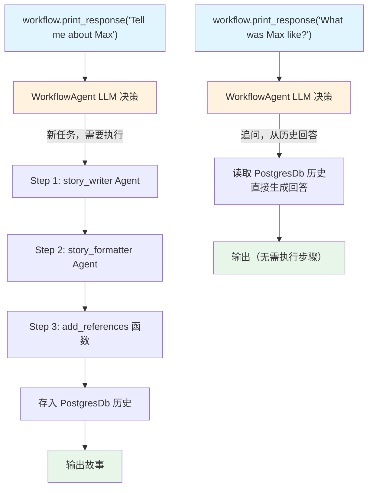

# basic_workflow_agent.py — 实现原理分析

> 源文件：`cookbook/04_workflows/06_advanced_concepts/workflow_agent/basic_workflow_agent.py`

## 概述

本示例展示 Agno **`WorkflowAgent` — 智能历史感知的 Workflow 控制器**：`WorkflowAgent` 是一个特殊 Agent，绑定到 Workflow 后，能根据用户问题和历史记录智能决定是**执行完整 Workflow 步骤**还是**直接从历史中回答**，避免对追问类问题重复执行昂贵的工作流。

**核心配置一览：**

| 配置项 | 值 | 说明 |
|--------|------|------|
| `WorkflowAgent` | `model + num_history_runs` | 绑定到 Workflow 的控制 Agent |
| `Workflow.agent` | `workflow_agent` | 启用 WorkflowAgent 控制 |
| `num_history_runs` | `4` | 历史轮次数量 |
| 数据库 | `PostgresDb` | 历史持久化 |

## 核心组件解析

### WorkflowAgent 配置

```python
from agno.workflow import WorkflowAgent

workflow_agent = WorkflowAgent(
    model=OpenAIChat(id="gpt-5.2"),
    num_history_runs=4,   # 读取最近 4 轮历史
)
```

### 将 WorkflowAgent 绑定到 Workflow

```python
workflow = Workflow(
    name="Story Generation Workflow",
    agent=workflow_agent,   # 关键：绑定 WorkflowAgent
    steps=[story_writer, story_formatter, add_references],
    db=PostgresDb(db_url),  # 历史持久化需要数据库
)
```

### 智能决策过程

```
用户: "Tell me a story about Max"
WorkflowAgent: → 判断需要执行 Workflow → 执行 story_writer → story_formatter → add_references

用户: "What was Max like?"（追问）
WorkflowAgent: → 判断可从历史回答 → 直接引用上次 Workflow 输出 → 无需重新执行步骤

用户: "Now tell me about Luna"（新任务）
WorkflowAgent: → 判断需要执行新 Workflow → 执行完整步骤
```

### 多种调用模式

```python
# 同步
workflow.print_response("Tell me a story about Max")

# 流式
workflow.print_response("Tell me about Rocky", stream=True)

# 异步
await workflow.aprint_response("Tell me about Luna")

# 异步流式
await workflow.aprint_response("Compare Rocky and Luna", stream=True)
```

## WorkflowAgent vs 直接调用对比

| 特性 | 直接调用 | WorkflowAgent |
|------|---------|--------------|
| 每次请求 | 始终执行所有步骤 | 智能判断是否执行 |
| 追问处理 | 重新执行（浪费） | 从历史直接回答 |
| 历史感知 | 无（需手动处理） | 内置（`num_history_runs`） |
| 成本 | 固定高成本 | 追问时成本极低 |

## Mermaid 流程图



## 关键源码文件索引

| 文件 | 关键类/函数 | 作用 |
|------|------------|------|
| `agno/workflow/__init__.py` | `WorkflowAgent` | 智能历史感知的 Workflow 控制 Agent |
| `agno/workflow/workflow.py` | `Workflow.agent` | 绑定 WorkflowAgent 的配置 |
| `agno/db/postgres.py` | `PostgresDb` | 历史持久化存储 |
