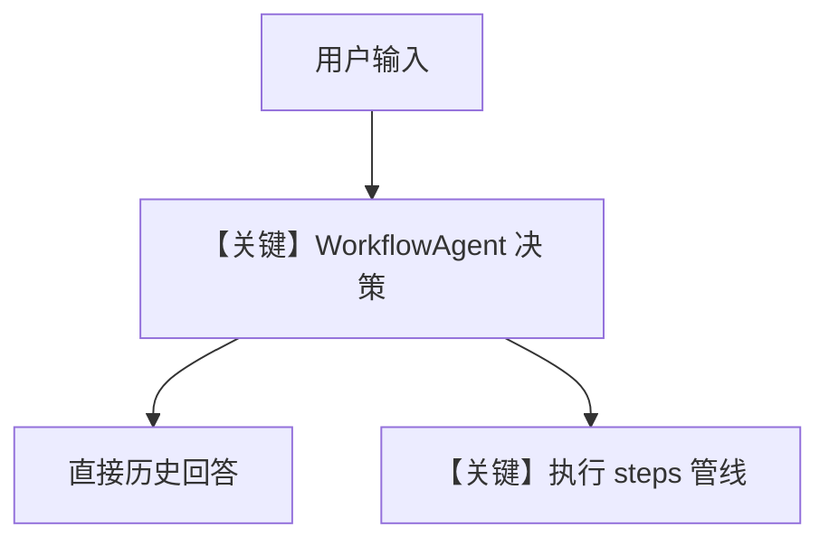

# basic_workflow_agent.py — 实现原理分析

> 源文件：`cookbook/04_workflows/06_advanced_concepts/workflow_agent/basic_workflow_agent.py`

## 概述

本示例展示 **`Workflow.agent: WorkflowAgent`**：`WorkflowAgent`（`OpenAIChat` + `num_history_runs`）在运行前决定**直接利用会话历史回答**还是**执行 `steps` 管线**（故事写作→格式化→函数步加参考文献）。底层 `Workflow` 使用 **PostgresDb**（`L50-53`），适合与生产持久化一致。

**核心配置一览：**

| 配置项 | 值 | 说明 |
|--------|------|------|
| `Workflow.agent` | `WorkflowAgent(model=..., num_history_runs=4)` | `L46-52` |
| `Workflow.steps` | `story_writer`, `story_formatter`, `add_references` | 含 Agent 与可调用 |
| `db` | `PostgresDb(db_url)` | 需本地 PG |
| `story_writer` / `story_formatter` | `gpt-5.2` + instructions | `L22-30` |

## 架构分层

```
用户消息 → WorkflowAgent 决策 → 或执行 steps 链 → DB 会话
```

## 核心组件解析

### WorkflowAgent

见 `agno/workflow/agent.py`：`Workflow` 构造参数 `agent` 启用「代理式」调度，结合历史决定何时跑工作流。

### add_references

`L36-40`：函数步拼接 `References:` 固定 URL。

### 运行机制与因果链

1. **数据路径**：多轮 `aprint_response`（`L60+`）演示 follow-up 问题依赖历史与管线选择。
2. **状态**：Postgres 存会话；`num_history_runs=4` 控制窗口。

## System Prompt 组装

- **WorkflowAgent** 与 **子 Agent** 各有模型侧 system；子 Agent instructions 字面量：

```text
You are tasked with writing a 100 word story based on a given topic
```

```text
You are tasked with breaking down a short story in prelogues, body and epilogue
```

（WorkflowAgent 内部指令以框架封装为准。）

## 完整 API 请求

`OpenAIChat` Chat Completions；`WorkflowAgent` 在决策与执行阶段可能多次调用。

## Mermaid 流程图


```mermaid
flowchart TD
    U["用户输入"] --> WA["【关键】WorkflowAgent 决策"]
    WA --> H["直接历史回答"]
    WA --> S["【关键】执行 steps 管线"]
```

## 关键源码文件索引

| 文件 | 作用 |
|------|------|
| `agno/workflow/agent.py` | `WorkflowAgent` |
| `agno/workflow/workflow.py` | `Workflow` 含 `agent` 字段 L225 |
