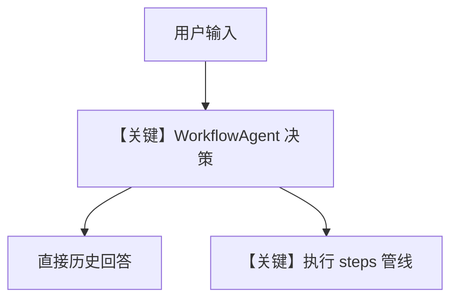

# basic_workflow_agent.py — 实现原理分析

<!-- cookbook-py-source:start -->
## 完整源码

```python
"""
Basic Workflow Agent
====================

Demonstrates using `WorkflowAgent` to decide when to execute workflow steps versus answer from history.
"""

import asyncio

from agno.agent import Agent
from agno.db.postgres import PostgresDb
from agno.models.openai import OpenAIChat
from agno.workflow import WorkflowAgent
from agno.workflow.types import StepInput
from agno.workflow.workflow import Workflow

# ---------------------------------------------------------------------------
# Create Agents
# ---------------------------------------------------------------------------
db_url = "postgresql+psycopg://ai:ai@localhost:5532/ai"

story_writer = Agent(
    model=OpenAIChat(id="gpt-5.2"),
    instructions="You are tasked with writing a 100 word story based on a given topic",
)

story_formatter = Agent(
    model=OpenAIChat(id="gpt-5.2"),
    instructions="You are tasked with breaking down a short story in prelogues, body and epilogue",
)


# ---------------------------------------------------------------------------
# Define Function Step
# ---------------------------------------------------------------------------
def add_references(step_input: StepInput):
    previous_output = step_input.previous_step_content

    if isinstance(previous_output, str):
        return previous_output + "\n\nReferences: https://www.agno.com"


# ---------------------------------------------------------------------------
# Create Workflow
# ---------------------------------------------------------------------------
workflow_agent = WorkflowAgent(model=OpenAIChat(id="gpt-5.2"), num_history_runs=4)

workflow = Workflow(
    name="Story Generation Workflow",
    description="A workflow that generates stories, formats them, and adds references",
    agent=workflow_agent,
    steps=[story_writer, story_formatter, add_references],
    db=PostgresDb(db_url),
)


# ---------------------------------------------------------------------------
# Run Workflow
# ---------------------------------------------------------------------------
async def run_async_examples() -> None:
    print("\n" + "=" * 80)
    print("FIRST CALL (ASYNC): Tell me a story about a husky named Max")
    print("=" * 80)
    await workflow.aprint_response("Tell me a story about a husky named Max")

    print("\n" + "=" * 80)
    print("SECOND CALL (ASYNC): What was Max like?")
    print("=" * 80)
    await workflow.aprint_response("What was Max like?")

    print("\n" + "=" * 80)
    print("THIRD CALL (ASYNC): Now tell me about a cat named Luna")
    print("=" * 80)
    await workflow.aprint_response("Now tell me about a cat named Luna")

    print("\n" + "=" * 80)
    print("FOURTH CALL (ASYNC): Compare Max and Luna")
    print("=" * 80)
    await workflow.aprint_response("Compare Max and Luna")


async def run_async_streaming_examples() -> None:
    print("\n" + "=" * 80)
    print("FIRST CALL (ASYNC STREAMING): Tell me a story about a dog named Rocky")
    print("=" * 80)
    await workflow.aprint_response(
        "Tell me a story about a dog named Rocky",
        stream=True,
    )

    print("\n" + "=" * 80)
    print("SECOND CALL (ASYNC STREAMING): What was Rocky's personality?")
    print("=" * 80)
    await workflow.aprint_response("What was Rocky's personality?", stream=True)

    print("\n" + "=" * 80)
    print("THIRD CALL (ASYNC STREAMING): Now tell me a story about a cat named Luna")
    print("=" * 80)
    await workflow.aprint_response(
        "Now tell me a story about a cat named Luna",
        stream=True,
    )

    print("\n" + "=" * 80)
    print("FOURTH CALL (ASYNC STREAMING): Compare Rocky and Luna")
    print("=" * 80)
    await workflow.aprint_response("Compare Rocky and Luna", stream=True)


if __name__ == "__main__":
    print("\n" + "=" * 80)
    print("FIRST CALL: Tell me a story about a husky named Max")
    print("=" * 80)
    workflow.print_response("Tell me a story about a husky named Max")

    print("\n" + "=" * 80)
    print("SECOND CALL: What was Max like?")
    print("=" * 80)
    workflow.print_response("What was Max like?")

    print("\n" + "=" * 80)
    print("THIRD CALL: Now tell me about a cat named Luna")
    print("=" * 80)
    workflow.print_response("Now tell me about a cat named Luna")

    print("\n" + "=" * 80)
    print("FOURTH CALL: Compare Max and Luna")
    print("=" * 80)
    workflow.print_response("Compare Max and Luna")

    print("\n\n" + "=" * 80)
    print("STREAMING MODE EXAMPLES")
    print("=" * 80)

    print("\n" + "=" * 80)
    print("FIRST CALL (STREAMING): Tell me a story about a dog named Rocky")
    print("=" * 80)
    workflow.print_response("Tell me a story about a dog named Rocky", stream=True)

    print("\n" + "=" * 80)
    print("SECOND CALL (STREAMING): What was Rocky's personality?")
    print("=" * 80)
    workflow.print_response("What was Rocky's personality?", stream=True)

    print("\n" + "=" * 80)
    print("THIRD CALL (STREAMING): Now tell me a story about a cat named Luna")
    print("=" * 80)
    workflow.print_response("Now tell me about a cat named Luna", stream=True)

    print("\n" + "=" * 80)
    print("FOURTH CALL (STREAMING): Compare Rocky and Luna")
    print("=" * 80)
    workflow.print_response("Compare Rocky and Luna", stream=True)

    asyncio.run(run_async_examples())
    asyncio.run(run_async_streaming_examples())
```

<!-- cookbook-py-source:end -->

> 源文件：`cookbook/04_workflows/06_advanced_concepts/workflow_agent/basic_workflow_agent.py`

## 概述

本示例展示 **`Workflow.agent: WorkflowAgent`**：`WorkflowAgent`（`OpenAIChat` + `num_history_runs`）在运行前决定**直接利用会话历史回答**还是**执行 `steps` 管线**（故事写作→格式化→函数步加参考文献）。底层 `Workflow` 使用 **PostgresDb**（`L50-53`），适合与生产持久化一致。

**核心配置一览：**

| 配置项 | 值 | 说明 |
|--------|------|------|
| `Workflow.agent` | `WorkflowAgent(model=..., num_history_runs=4)` | `L46-52` |
| `Workflow.steps` | `story_writer`, `story_formatter`, `add_references` | 含 Agent 与可调用 |
| `db` | `PostgresDb(db_url)` | 需本地 PG |
| `story_writer` / `story_formatter` | `gpt-5.2` + instructions | `L22-30` |

## 架构分层

```
用户消息 → WorkflowAgent 决策 → 或执行 steps 链 → DB 会话
```

## 核心组件解析

### WorkflowAgent

见 `agno/workflow/agent.py`：`Workflow` 构造参数 `agent` 启用「代理式」调度，结合历史决定何时跑工作流。

### add_references

`L36-40`：函数步拼接 `References:` 固定 URL。

### 运行机制与因果链

1. **数据路径**：多轮 `aprint_response`（`L60+`）演示 follow-up 问题依赖历史与管线选择。
2. **状态**：Postgres 存会话；`num_history_runs=4` 控制窗口。

## System Prompt 组装

- **WorkflowAgent** 与 **子 Agent** 各有模型侧 system；子 Agent instructions 字面量：

```text
You are tasked with writing a 100 word story based on a given topic
```

```text
You are tasked with breaking down a short story in prelogues, body and epilogue
```

（WorkflowAgent 内部指令以框架封装为准。）

## 完整 API 请求

`OpenAIChat` Chat Completions；`WorkflowAgent` 在决策与执行阶段可能多次调用。

## Mermaid 流程图


```mermaid
flowchart TD
    U["用户输入"] --> WA["【关键】WorkflowAgent 决策"]
    WA --> H["直接历史回答"]
    WA --> S["【关键】执行 steps 管线"]
```

## 关键源码文件索引

| 文件 | 作用 |
|------|------|
| `agno/workflow/agent.py` | `WorkflowAgent` |
| `agno/workflow/workflow.py` | `Workflow` 含 `agent` 字段 L225 |
