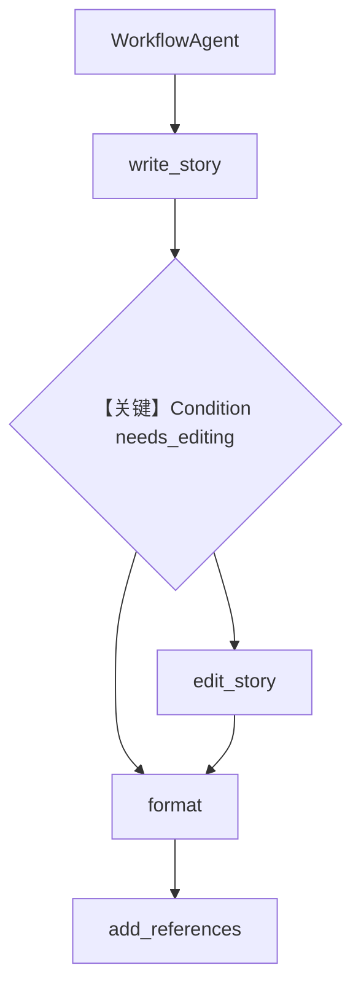

# workflow_agent_with_condition.py — 实现原理分析

> 源文件：`cookbook/04_workflows/06_advanced_concepts/workflow_agent/workflow_agent_with_condition.py`

## 概述

本示例在 **`basic_workflow_agent`** 之上增加 **`Condition(evaluator=needs_editing)`**：根据 `previous_step_content` 字数与标点决定**是否执行编辑步**，再进入格式化与 `add_references`；仍使用 **`WorkflowAgent`** + **PostgresDb**。

**核心配置一览：**

| 配置项 | 说明 |
|--------|------|
| `needs_editing` | `bool` 函数 `L46-49` |
| `Condition` | 包裹 `edit_step` 等 |
| `Workflow.agent` | `WorkflowAgent` |
| `db_url` | 本地 Postgres |

## 运行机制与因果链

1. **数据路径**：WorkflowAgent 决策 → 写作 → 条件编辑 → 格式化 → 参考文献函数。
2. **关键分支**：`needs_editing` 为假则跳过编辑分支（以实际图结构为准，见源码 `L70+`）。

## System Prompt 组装

`story_writer` / `story_editor` / `story_formatter` instructions（`L24-40`）逐字还原。

## Mermaid 流程图

## 关键源码文件索引

| 文件 | 作用 |
|------|------|
| `agno/workflow/condition.py` | `Condition` |
| `agno/workflow/agent.py` | `WorkflowAgent` |
