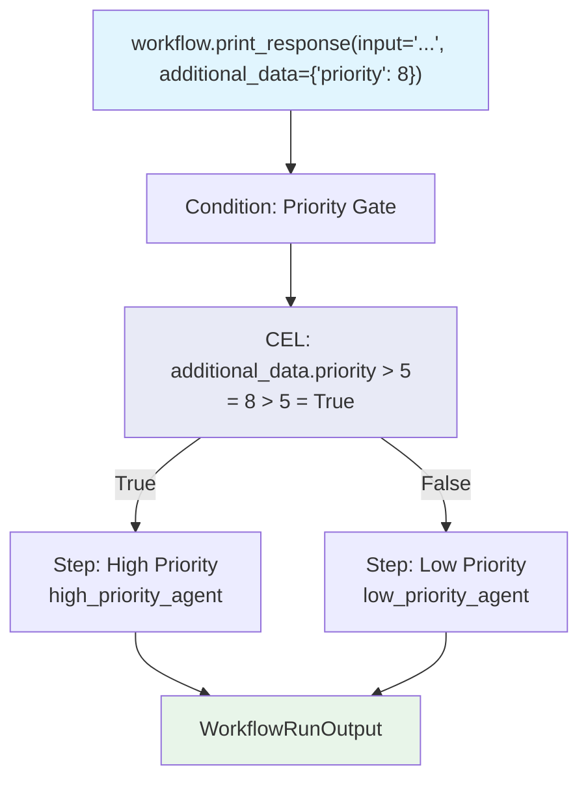

# cel_additional_data.py — 实现原理分析

> 源文件：`cookbook/04_workflows/07_cel_expressions/condition/cel_additional_data.py`

## 概述

本示例展示 Agno Workflow **CEL 通过 `additional_data` 变量读取运行时参数进行路由**：调用方在 `workflow.print_response(additional_data={"priority": 8})` 中传入优先级值，CEL 表达式 `"additional_data.priority > 5"` 直接读取该值判断是否为高优先级请求，实现调用方驱动的路由策略。

**核心配置一览：**

| 配置项 | 值 | 说明 |
|--------|------|------|
| `additional_data` | `{"priority": 8}` | 运行时传入的附加参数 |
| CEL 变量 | `additional_data.priority` | 直接读取字段值 |
| CEL 表达式 | `"additional_data.priority > 5"` | 数值比较路由 |

## 核心组件解析

### CEL 读取 additional_data

```python
Condition(
    name="Priority Gate",
    evaluator="additional_data.priority > 5",   # 读取 additional_data.priority
    steps=[Step(name="High Priority", agent=high_priority_agent)],
    else_steps=[Step(name="Low Priority", agent=low_priority_agent)],
)
```

### 调用时传入 additional_data

```python
# 高优先级：priority=8 > 5 → high_priority_agent
workflow.print_response(
    input="Review this critical security report.",
    additional_data={"priority": 8},
)

# 低优先级：priority=2 ≤ 5 → low_priority_agent
workflow.print_response(
    input="Update the FAQ page.",
    additional_data={"priority": 2},
)
```

## CEL additional_data 可用场景

| 使用场景 | CEL 表达式 | 说明 |
|---------|-----------|------|
| 数值优先级 | `additional_data.priority > 5` | 大小比较 |
| 字符串标志 | `additional_data.mode == "expert"` | 字符串匹配 |
| 布尔标志 | `additional_data.is_premium` | 布尔判断 |
| 嵌套字段 | `additional_data.user.role == "admin"` | 嵌套访问 |

## Mermaid 流程图



## 关键源码文件索引

| 文件 | 关键类/函数 | 作用 |
|------|------------|------|
| `agno/workflow/cel.py` | CEL 上下文 | 注入 `additional_data` 变量 |
| `agno/workflow/condition.py` | `Condition.evaluator` | 支持 str CEL 表达式 |
