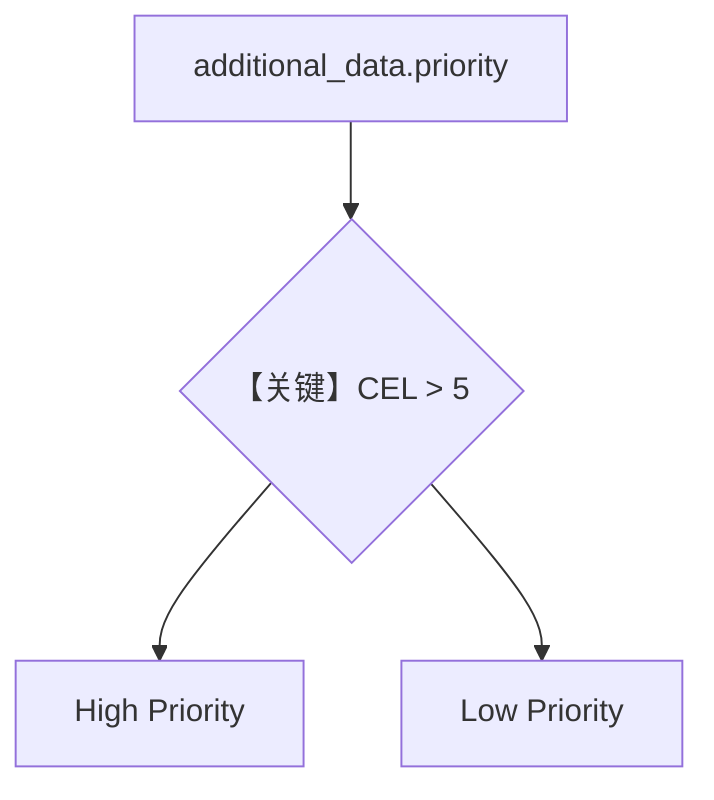

# cel_additional_data.py — 实现原理分析

> 源文件：`cookbook/04_workflows/07_cel_expressions/condition/cel_additional_data.py`

## 概述

本示例展示 CEL 条件 **`additional_data.priority > 5`**：`Workflow.print_response` / `run` 传入的 `additional_data` 字典进入 CEL 上下文，用于优先级路由，无需 Python `evaluator` 函数。

**核心配置一览：**

| 配置项 | 值 |
|--------|-----|
| `Condition.evaluator` | `"additional_data.priority > 5"` |
| `high_priority_agent` / `low_priority_agent` | `gpt-4o-mini` + instructions |
| 运行示例 | `additional_data={"priority": 8}` 与 `{2}` |

## 核心组件解析

CEL 中 `additional_data` 为 Map，键 `priority` 与数值比较见 `condition.py` 文档与 `evaluate_cel_condition_evaluator`。

## System Prompt 组装

### 还原（High Priority Agent）

```text
You handle high-priority tasks. Be thorough and detailed.
```

### 还原（Low Priority Agent）

```text
You handle standard tasks. Be helpful and concise.
```

## Mermaid 流程图


```mermaid
flowchart TD
    AD["additional_data.priority"] --> C{"【关键】CEL > 5"}
    C --> H["High Priority"]
    C --> L["Low Priority"]
```

## 关键源码文件索引

| 文件 | 作用 |
|------|------|
| `agno/workflow/condition.py` | CEL 求值 |
| `agno/workflow/cel.py` | CEL 环境 |
