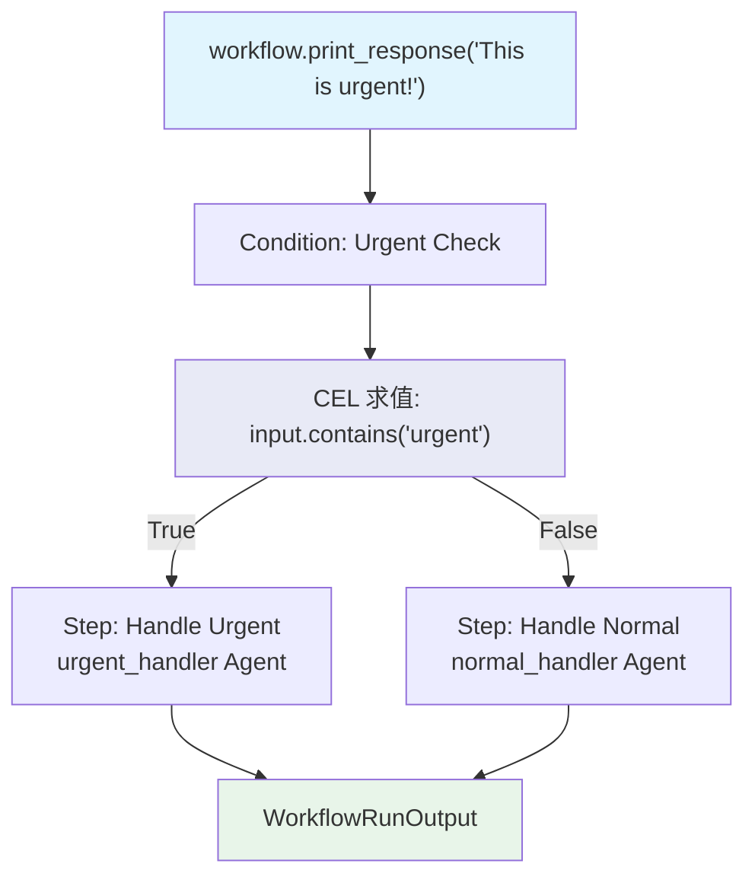

# cel_basic.py — 实现原理分析

> 源文件：`cookbook/04_workflows/07_cel_expressions/condition/cel_basic.py`

## 概述

本示例展示 Agno Workflow **`Condition` 使用 CEL（Common Expression Language）字符串作为 `evaluator`**：无需编写 Python 函数，直接传入 CEL 表达式字符串，Workflow 自动解析执行，基于 `input` 内容进行条件路由。

**核心配置一览：**

| 配置项 | 值 | 说明 |
|--------|------|------|
| `evaluator` 类型 | `str`（CEL 表达式） | 替代 Python 函数 |
| CEL 依赖 | `cel-python` 包 | `pip install cel-python` |
| 可用变量 | `input`, `session_state`, `previous_step_content` | CEL 上下文变量 |
| 检查可用性 | `from agno.workflow import CEL_AVAILABLE` | 运行前检查 |

## 核心组件解析

### CEL 字符串 evaluator

```python
from agno.workflow import CEL_AVAILABLE, Condition, Step, Workflow

workflow = Workflow(
    name="CEL Input Routing",
    steps=[
        Condition(
            name="Urgent Check",
            evaluator='input.contains("urgent")',  # CEL 字符串，非 Python 函数
            steps=[
                Step(name="Handle Urgent", agent=urgent_handler),
            ],
            else_steps=[
                Step(name="Handle Normal", agent=normal_handler),
            ],
        ),
    ],
)
```

### 可用 CEL 上下文变量

| 变量 | 类型 | 说明 |
|------|------|------|
| `input` | `string` | 当前 Workflow 输入 |
| `session_state` | `map` | `session_state["key"]` 读取 |
| `previous_step_content` | `string` | 前一步骤输出内容 |
| `all_success` | `bool` | 所有前驱步骤成功 |
| `current_iteration` | `int` | 当前 Loop 迭代次数（Loop 内） |

### CEL vs Python 函数对比

```python
# Python 函数方式
def needs_urgent(step_input: StepInput) -> bool:
    return "urgent" in (step_input.input or "").lower()

# CEL 字符串方式（等价）
evaluator='input.contains("urgent")'
```

### 可用性检查

```python
if not CEL_AVAILABLE:
    print("CEL is not available. Install with: pip install cel-python")
    exit(1)
```

## Mermaid 流程图



## CEL 表达式示例

```cel
# 字符串检查
input.contains("urgent")

# 会话状态读取
session_state["mode"] == "thorough"

# 前驱输出长度检查
previous_step_content.length() > 200

# 组合条件
input.contains("tech") && session_state["user_type"] == "engineer"
```

## 关键源码文件索引

| 文件 | 关键类/函数 | 作用 |
|------|------------|------|
| `agno/workflow/cel.py` | CEL 上下文和求值器 | 构建 CEL 执行环境 |
| `agno/workflow/condition.py` | `Condition.evaluator` L79 | 支持 str 类型 CEL 表达式 |
| `agno/workflow/__init__.py` | `CEL_AVAILABLE` | CEL 可用性标志 |
