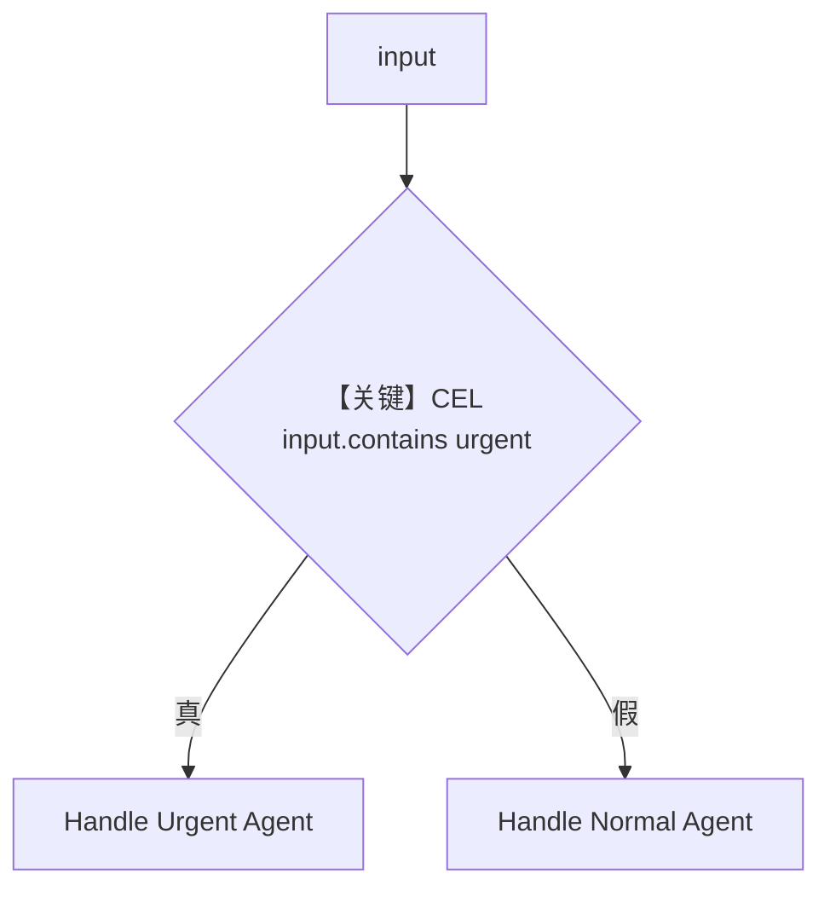

# cel_basic.py — 实现原理分析

<!-- cookbook-py-source:start -->
## 完整源码

```python
"""Condition with CEL expression: route based on input content.
============================================================

Uses input.contains() to check whether the request is urgent,
branching to different agents via if/else steps.

Requirements:
    pip install cel-python
"""

from agno.agent import Agent
from agno.models.openai import OpenAIChat
from agno.workflow import CEL_AVAILABLE, Condition, Step, Workflow

# ---------------------------------------------------------------------------
# Setup
# ---------------------------------------------------------------------------
if not CEL_AVAILABLE:
    print("CEL is not available. Install with: pip install cel-python")
    exit(1)

# ---------------------------------------------------------------------------
# Create Agents
# ---------------------------------------------------------------------------
urgent_handler = Agent(
    name="Urgent Handler",
    model=OpenAIChat(id="gpt-4o-mini"),
    instructions="You handle urgent requests with high priority. Be concise and action-oriented.",
    markdown=True,
)

normal_handler = Agent(
    name="Normal Handler",
    model=OpenAIChat(id="gpt-4o-mini"),
    instructions="You handle normal requests thoroughly and thoughtfully.",
    markdown=True,
)

# ---------------------------------------------------------------------------
# Create Workflow
# ---------------------------------------------------------------------------
workflow = Workflow(
    name="CEL Input Routing",
    steps=[
        Condition(
            name="Urgent Check",
            evaluator='input.contains("urgent")',
            steps=[
                Step(name="Handle Urgent", agent=urgent_handler),
            ],
            else_steps=[
                Step(name="Handle Normal", agent=normal_handler),
            ],
        ),
    ],
)

# ---------------------------------------------------------------------------
# Run Workflow
# ---------------------------------------------------------------------------
if __name__ == "__main__":
    print("--- Urgent request ---")
    workflow.print_response(
        input="This is an urgent request - please help immediately!"
    )
    print()

    print("--- Normal request ---")
    workflow.print_response(input="I have a general question about your services.")
```

<!-- cookbook-py-source:end -->

> 源文件：`cookbook/04_workflows/07_cel_expressions/condition/cel_basic.py`

## 概述

本示例展示 Agno 的 **`Condition.evaluator` 使用 CEL 字符串** 机制：在已安装 `cel-python` 时，`'input.contains("urgent")'` 由 `evaluate_cel_condition_evaluator` 求值；为真走 `steps`，否则走 `else_steps`。需 **`CEL_AVAILABLE`** 为真，否则脚本退出（`L18-20`）。

**核心配置一览：**

| 配置项 | 值 | 说明 |
|--------|------|------|
| `Workflow.name` | `"CEL Input Routing"` | 名称 |
| `Condition.name` | `"Urgent Check"` | 条件名 |
| `Condition.evaluator` | `'input.contains("urgent")'` | CEL 表达式 |
| `Condition.steps` | `Handle Urgent` | urgent_handler |
| `Condition.else_steps` | `Handle Normal` | normal_handler |
| `urgent_handler` | `OpenAIChat(gpt-4o-mini)` + instructions | `L25-29` |
| `normal_handler` | `OpenAIChat(gpt-4o-mini)` + instructions | `L31-36` |

## 架构分层

```
用户 input 字符串          agno.workflow.condition
┌────────────────┐         ┌─────────────────────────────────────┐
│ cel_basic.py   │ ──────> │ Condition: is_cel_expression →      │
│                │         │ evaluate_cel_condition_evaluator()   │
│                │         │ True → steps / False → else_steps    │
└────────────────┘         └─────────────────────────────────────┘
                                      │
                                      ▼
                               OpenAIChat 子 Agent
```

## 核心组件解析

### CEL 检测与求值

`agno/workflow/condition.py`：CEL 分支调用 `evaluate_cel_condition_evaluator(self.evaluator, step_input, session_state)`（约 `L317`、`L355`）。`is_cel_expression` 与 `cel.py` 中 `_CEL_INDICATORS` 用于区分函数字面量与表达式（`cel.py` `L37-L65`）。

### 运行机制与因果链

1. **数据路径**：`input` 进入 CEL 上下文变量 `input` → 布尔结果 → 单步 Agent。
2. **状态**：无额外 session_state 本例未设；可扩展 CEL 访问 `session_state`（见 `Condition` 文档字符串 `condition.py` `L54-L59`）。
3. **与 Python evaluator 差异**：无需自定义 `def`，适合运营配置化。

## System Prompt 组装

| Agent | instructions（完整字面量） |
|-------|---------------------------|
| urgent_handler | `You handle urgent requests with high priority. Be concise and action-oriented.` |
| normal_handler | `You handle normal requests thoroughly and thoughtfully.` |

### 还原后的完整 System 文本（urgent_handler）

```text
You handle urgent requests with high priority. Be concise and action-oriented.
```

## 完整 API 请求

`OpenAIChat(id="gpt-4o-mini")` → Chat Completions；仅在被选中的分支调用。

## Mermaid 流程图


```mermaid
flowchart TD
    IN["input"] --> C{"【关键】CEL input.contains urgent"}
    C -->|真| U["Handle Urgent Agent"]
    C -->|假| N["Handle Normal Agent"]
```

## 关键源码文件索引

| 文件 | 关键函数/类 | 作用 |
|------|------------|------|
| `agno/workflow/condition.py` | `evaluate_cel_condition_evaluator` ~L317 | CEL 求值 |
| `agno/workflow/cel.py` | `CEL_AVAILABLE`；`is_cel_expression` | CEL 支持 |
| `agno/workflow/workflow.py` | `Workflow.run` L6411 | 执行 |
