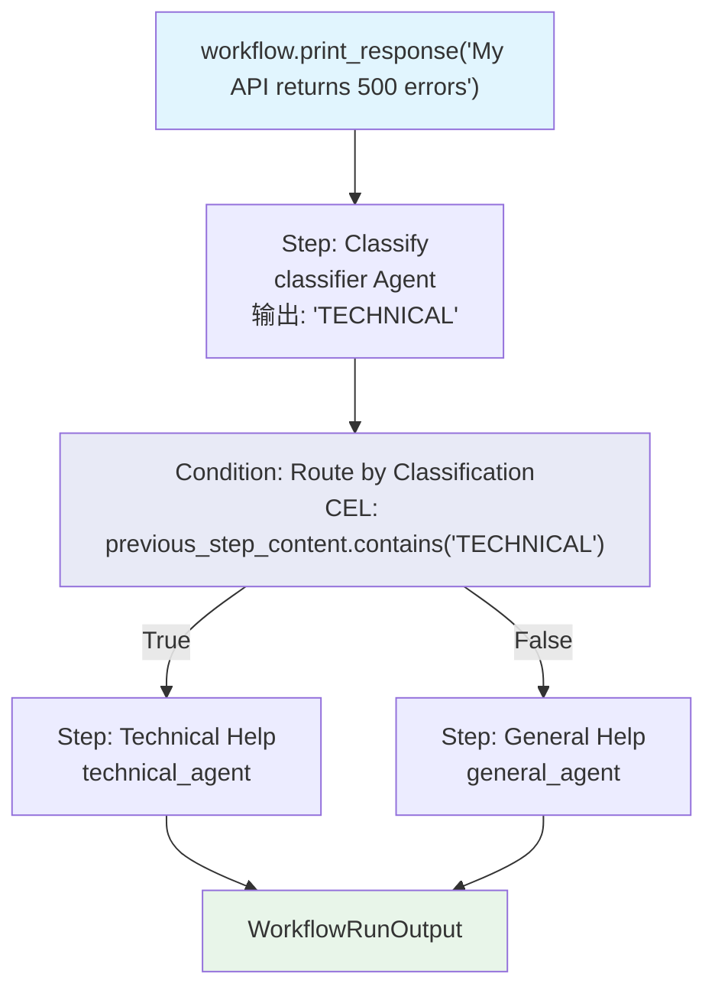

# cel_previous_step.py — 实现原理分析

> 源文件：`cookbook/04_workflows/07_cel_expressions/condition/cel_previous_step.py`

## 概述

本示例展示 Agno Workflow **CEL 通过 `previous_step_content` 变量读取前驱步骤输出进行路由**：先运行分类器 Agent（输出 "TECHNICAL" 或 "GENERAL"），再用 CEL `previous_step_content.contains("TECHNICAL")` 检测分类结果并路由到不同处理 Agent，实现 LLM 驱动的内容分类路由。

**核心配置一览：**

| 配置项 | 值 | 说明 |
|--------|------|------|
| CEL 变量 | `previous_step_content` | 前驱步骤输出的字符串内容 |
| CEL 方法 | `.contains("TECHNICAL")` | 字符串包含检查 |
| 模式 | 分类器 Step → CEL Condition 路由 | 典型分类路由模式 |

## 核心组件解析

### 分类器 Agent（输出结构化关键词）

```python
classifier = Agent(
    name="Classifier",
    instructions=(
        "Classify the request as either TECHNICAL or GENERAL. "
        "Respond with exactly one word: TECHNICAL or GENERAL."
    ),
    markdown=False,  # 纯文本，便于 CEL 解析
)
```

### CEL 读取 previous_step_content

```python
workflow = Workflow(
    steps=[
        Step(name="Classify", agent=classifier),  # 第一步：分类
        Condition(
            name="Route by Classification",
            evaluator='previous_step_content.contains("TECHNICAL")',  # 读取分类结果
            steps=[Step(name="Technical Help", agent=technical_agent)],
            else_steps=[Step(name="General Help", agent=general_agent)],
        ),
    ],
)
```

### 执行流程

```
输入: "My API returns 500 errors when I send POST requests"
Step 1 (classifier): 输出 "TECHNICAL"
Condition CEL: previous_step_content.contains("TECHNICAL") = True
→ 执行 technical_agent

输入: "What are your business hours?"
Step 1 (classifier): 输出 "GENERAL"
Condition CEL: previous_step_content.contains("TECHNICAL") = False
→ 执行 general_agent
```

## Mermaid 流程图



## 关键源码文件索引

| 文件 | 关键类/函数 | 作用 |
|------|------------|------|
| `agno/workflow/cel.py` | CEL 上下文 | 注入 `previous_step_content` 变量 |
| `agno/workflow/condition.py` | `Condition.evaluator` | 支持 str CEL 表达式 |
