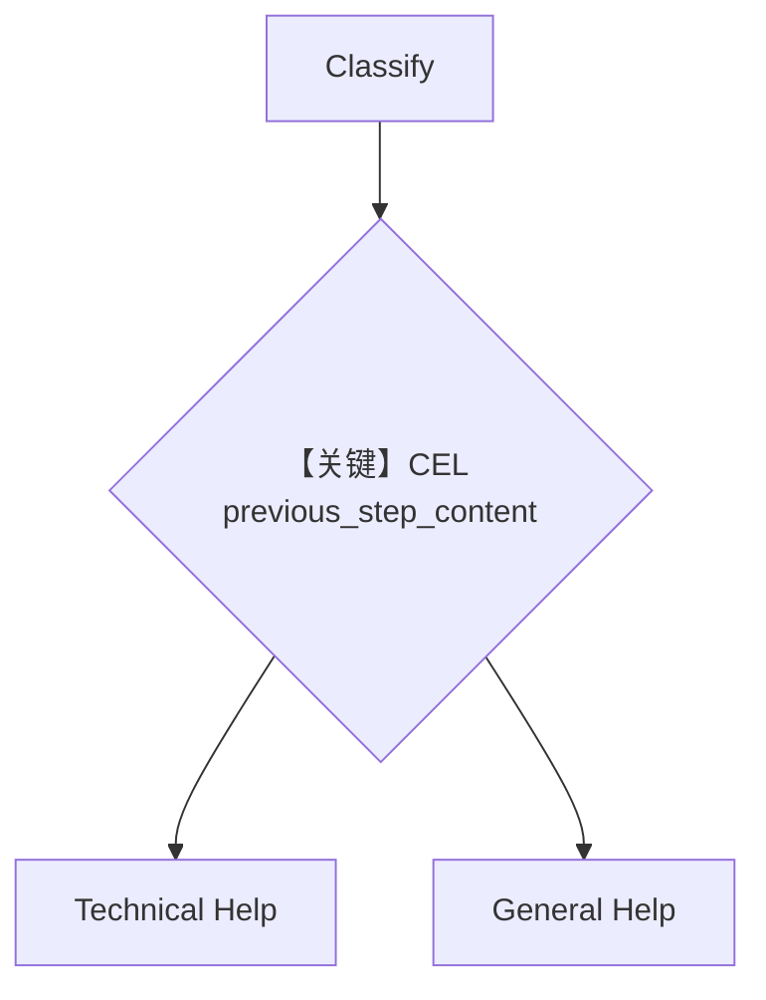

# cel_previous_step.py — 实现原理分析

<!-- cookbook-py-source:start -->
## 完整源码

```python
"""Condition with CEL expression: branching on previous step output.
=================================================================

Runs a classifier step first, then uses previous_step_content.contains()
to decide the next step.

Requirements:
    pip install cel-python
"""

from agno.agent import Agent
from agno.models.openai import OpenAIChat
from agno.workflow import CEL_AVAILABLE, Condition, Step, Workflow

# ---------------------------------------------------------------------------
# Setup
# ---------------------------------------------------------------------------
if not CEL_AVAILABLE:
    print("CEL is not available. Install with: pip install cel-python")
    exit(1)

# ---------------------------------------------------------------------------
# Create Agents
# ---------------------------------------------------------------------------
classifier = Agent(
    name="Classifier",
    model=OpenAIChat(id="gpt-4o-mini"),
    instructions=(
        "Classify the request as either TECHNICAL or GENERAL. "
        "Respond with exactly one word: TECHNICAL or GENERAL."
    ),
    markdown=False,
)

technical_agent = Agent(
    name="Technical Support",
    model=OpenAIChat(id="gpt-4o-mini"),
    instructions="You are a technical support specialist. Provide detailed technical help.",
    markdown=True,
)

general_agent = Agent(
    name="General Support",
    model=OpenAIChat(id="gpt-4o-mini"),
    instructions="You handle general inquiries. Be friendly and helpful.",
    markdown=True,
)

# ---------------------------------------------------------------------------
# Create Workflow
# ---------------------------------------------------------------------------
workflow = Workflow(
    name="CEL Classify and Route",
    steps=[
        Step(name="Classify", agent=classifier),
        Condition(
            name="Route by Classification",
            evaluator='previous_step_content.contains("TECHNICAL")',
            steps=[
                Step(name="Technical Help", agent=technical_agent),
            ],
            else_steps=[
                Step(name="General Help", agent=general_agent),
            ],
        ),
    ],
)

# ---------------------------------------------------------------------------
# Run Workflow
# ---------------------------------------------------------------------------
if __name__ == "__main__":
    print("--- Technical question ---")
    workflow.print_response(
        input="My API returns 500 errors when I send POST requests with JSON payloads."
    )
    print()

    print("--- General question ---")
    workflow.print_response(input="What are your business hours?")
```

<!-- cookbook-py-source:end -->

> 源文件：`cookbook/04_workflows/07_cel_expressions/condition/cel_previous_step.py`

## 概述

本示例展示 **先分类 Step，再 CEL 读 `previous_step_content`**：`evaluator='previous_step_content.contains("TECHNICAL")'` 根据上一步分类器输出字符串分支到技术或通用支持 Agent。

**核心配置一览：**

| 配置项 | 值 |
|--------|-----|
| 第一步 | `Classify` + `classifier` Agent |
| `Condition.evaluator` | `'previous_step_content.contains("TECHNICAL")'` |
| `technical_agent` / `general_agent` | 各一 Step |

## 核心组件解析

`classifier` 指令要求只输出 `TECHNICAL` 或 `GENERAL` 单词（`L28-31`），以便 CEL 稳定匹配。

## System Prompt 组装

### Classifier

```text
Classify the request as either TECHNICAL or GENERAL. Respond with exactly one word: TECHNICAL or GENERAL.
```

### Technical Support

```text
You are a technical support specialist. Provide detailed technical help.
```

## Mermaid 流程图


```mermaid
flowchart TD
    S["Classify"] --> C{"【关键】CEL previous_step_content"}
    C --> T["Technical Help"]
    C --> G["General Help"]
```

## 关键源码文件索引

| 文件 | 作用 |
|------|------|
| `agno/workflow/condition.py` | `previous_step_content` 注入 CEL |
