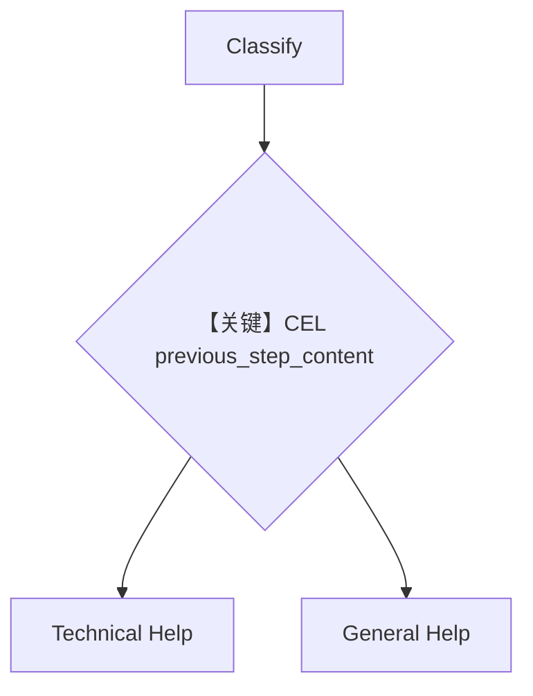

# cel_previous_step.py — 实现原理分析

> 源文件：`cookbook/04_workflows/07_cel_expressions/condition/cel_previous_step.py`

## 概述

本示例展示 **先分类 Step，再 CEL 读 `previous_step_content`**：`evaluator='previous_step_content.contains("TECHNICAL")'` 根据上一步分类器输出字符串分支到技术或通用支持 Agent。

**核心配置一览：**

| 配置项 | 值 |
|--------|-----|
| 第一步 | `Classify` + `classifier` Agent |
| `Condition.evaluator` | `'previous_step_content.contains("TECHNICAL")'` |
| `technical_agent` / `general_agent` | 各一 Step |

## 核心组件解析

`classifier` 指令要求只输出 `TECHNICAL` 或 `GENERAL` 单词（`L28-31`），以便 CEL 稳定匹配。

## System Prompt 组装

### Classifier

```text
Classify the request as either TECHNICAL or GENERAL. Respond with exactly one word: TECHNICAL or GENERAL.
```

### Technical Support

```text
You are a technical support specialist. Provide detailed technical help.
```

## Mermaid 流程图


```mermaid
flowchart TD
    S["Classify"] --> C{"【关键】CEL previous_step_content"}
    C --> T["Technical Help"]
    C --> G["General Help"]
```

## 关键源码文件索引

| 文件 | 作用 |
|------|------|
| `agno/workflow/condition.py` | `previous_step_content` 注入 CEL |
