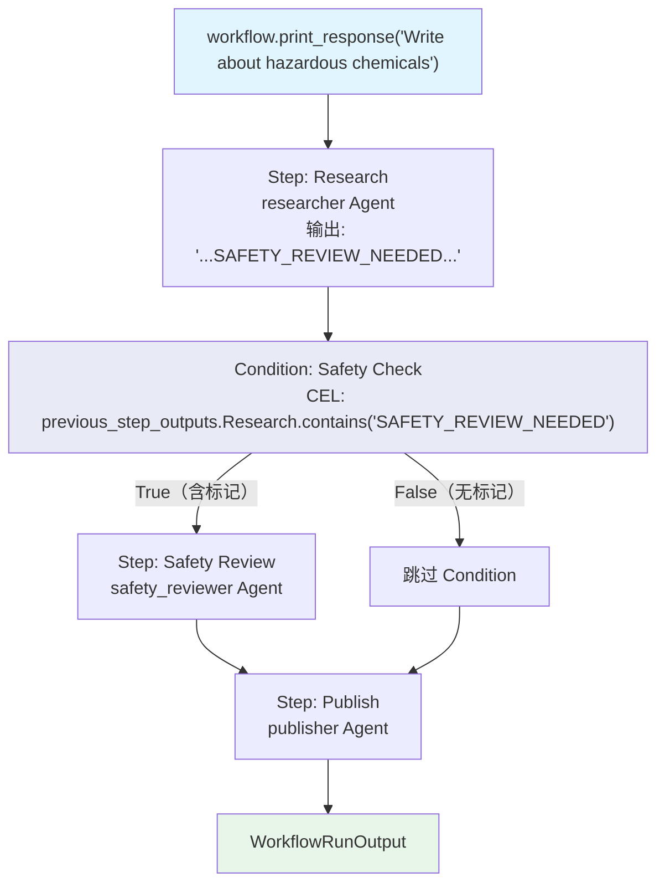

# cel_previous_step_outputs.py — 实现原理分析

> 源文件：`cookbook/04_workflows/07_cel_expressions/condition/cel_previous_step_outputs.py`

## 概述

本示例展示 Agno Workflow **CEL 通过 `previous_step_outputs` Map 按步骤名访问特定步骤输出**：`previous_step_outputs.StepName.contains("keyword")` 允许 CEL 直接按步骤名读取某个具名步骤的输出，实现精确的多步骤管道中的条件判断。

**核心配置一览：**

| 配置项 | 值 | 说明 |
|--------|------|------|
| CEL 变量 | `previous_step_outputs` | 所有步骤输出的 Map |
| 访问语法 | `previous_step_outputs.StepName` | 按步骤名访问 |
| 结合使用 | `.contains("keyword")` | 检查内容包含关键词 |

## 核心组件解析

### CEL 按步骤名访问输出

```python
workflow = Workflow(
    steps=[
        Step(name="Research", agent=researcher),   # 步骤名: "Research"
        Condition(
            name="Safety Check",
            # 读取名为 "Research" 的步骤的输出，检查是否含 "SAFETY_REVIEW_NEEDED"
            evaluator='previous_step_outputs.Research.contains("SAFETY_REVIEW_NEEDED")',
            steps=[Step(name="Safety Review", agent=safety_reviewer)],
        ),
        Step(name="Publish", agent=publisher),
    ],
)
```

### Agent 主动发送安全标记

```python
researcher = Agent(
    instructions=(
        "Research the topic. If the topic involves safety risks, "
        "include SAFETY_REVIEW_NEEDED in your response."  # Agent 协议：包含标记
    ),
)
```

### 执行流程

```
输入: "Write about gardening tips"
Research 输出: "Here are top gardening tips: 1..."（不含 SAFETY_REVIEW_NEEDED）
CEL: previous_step_outputs.Research.contains("SAFETY_REVIEW_NEEDED") = False
→ 跳过 Safety Review → 直接 Publish

输入: "Write about handling hazardous chemicals"
Research 输出: "SAFETY_REVIEW_NEEDED: This topic involves..."
CEL: = True → 执行 Safety Review → Publish
```

## Mermaid 流程图



## 关键源码文件索引

| 文件 | 关键类/函数 | 作用 |
|------|------------|------|
| `agno/workflow/cel.py` | CEL 上下文 | 注入 `previous_step_outputs` Map |
| `agno/workflow/condition.py` | `Condition.evaluator` | 支持 str CEL 表达式 |
