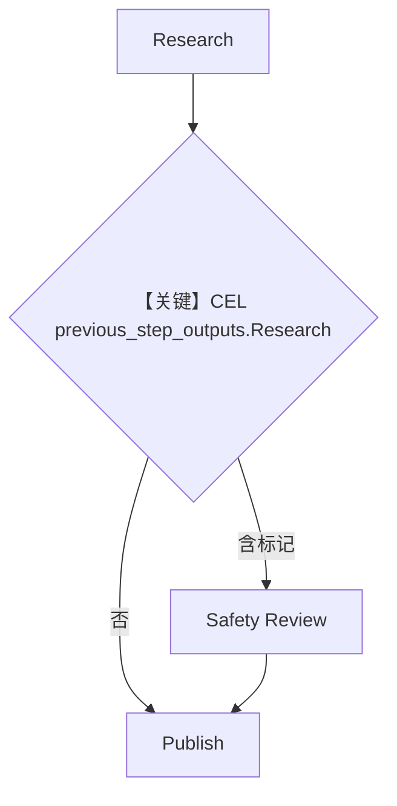

# cel_previous_step_outputs.py — 实现原理分析

<!-- cookbook-py-source:start -->
## 完整源码

```python
"""Condition with CEL: branch based on a named step's output.
==========================================================

Uses previous_step_outputs map to check the output of a specific
step by name, enabling multi-step pipelines with conditional logic.

Requirements:
    pip install cel-python
"""

from agno.agent import Agent
from agno.models.openai import OpenAIChat
from agno.workflow import CEL_AVAILABLE, Condition, Step, Workflow

# ---------------------------------------------------------------------------
# Setup
# ---------------------------------------------------------------------------
if not CEL_AVAILABLE:
    print("CEL is not available. Install with: pip install cel-python")
    exit(1)

# ---------------------------------------------------------------------------
# Create Agents
# ---------------------------------------------------------------------------
researcher = Agent(
    name="Researcher",
    model=OpenAIChat(id="gpt-4o-mini"),
    instructions="Research the topic. If the topic involves safety risks, include SAFETY_REVIEW_NEEDED in your response.",
    markdown=True,
)

safety_reviewer = Agent(
    name="Safety Reviewer",
    model=OpenAIChat(id="gpt-4o-mini"),
    instructions="Review the research for safety concerns and provide recommendations.",
    markdown=True,
)

publisher = Agent(
    name="Publisher",
    model=OpenAIChat(id="gpt-4o-mini"),
    instructions="Prepare the research for publication.",
    markdown=True,
)

# ---------------------------------------------------------------------------
# Create Workflow
# ---------------------------------------------------------------------------
workflow = Workflow(
    name="CEL Previous Step Outputs Condition",
    steps=[
        Step(name="Research", agent=researcher),
        Condition(
            name="Safety Check",
            # Check the Research step output by name
            evaluator='previous_step_outputs.Research.contains("SAFETY_REVIEW_NEEDED")',
            steps=[
                Step(name="Safety Review", agent=safety_reviewer),
            ],
        ),
        Step(name="Publish", agent=publisher),
    ],
)

# ---------------------------------------------------------------------------
# Run Workflow
# ---------------------------------------------------------------------------
if __name__ == "__main__":
    print("--- Safe topic (skips safety review) ---")
    workflow.print_response(input="Write about gardening tips for beginners.")
    print()

    print("--- Safety-sensitive topic (triggers safety review) ---")
    workflow.print_response(
        input="Write about handling hazardous chemicals in a home lab."
    )
```

<!-- cookbook-py-source:end -->

> 源文件：`cookbook/04_workflows/07_cel_expressions/condition/cel_previous_step_outputs.py`

## 概述

本示例展示 CEL 使用 **`previous_step_outputs.<StepName>`** 按**具名步骤**取输出字符串：`previous_step_outputs.Research.contains("SAFETY_REVIEW_NEEDED")` 决定是否进入 `Safety Review` 步（`L55-59`）。依赖前序 `Step` 的 `name` 与地图键一致（此处为 `"Research"`）。

**核心配置一览：**

| 配置项 | 值 |
|--------|-----|
| `Research` Step | `researcher` 须在内容中含标记短语以触发 |
| `evaluator` | `'previous_step_outputs.Research.contains("SAFETY_REVIEW_NEEDED")'` |
| 后续 | 可选 Safety Review → 必 Publish |

## 核心组件解析

`Condition` 文档（`condition.py`）说明 `previous_step_outputs` 为 step name 到 content 的映射；CEL 中按属性访问。

## System Prompt 组装

### Researcher

```text
Research the topic. If the topic involves safety risks, include SAFETY_REVIEW_NEEDED in your response.
```

## Mermaid 流程图


```mermaid
flowchart TD
    R["Research"] --> C{"【关键】CEL previous_step_outputs.Research"}
    C -->|含标记| S["Safety Review"]
    C -->|否| P["Publish"]
    S --> P
```

## 关键源码文件索引

| 文件 | 作用 |
|------|------|
| `agno/workflow/condition.py` | CEL 变量 `previous_step_outputs` |
