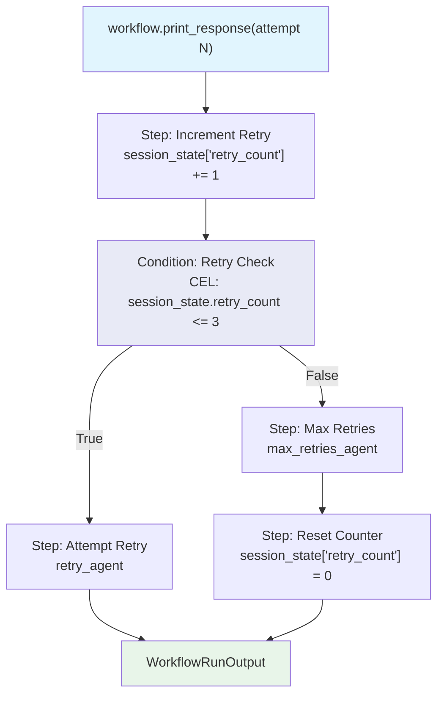

# cel_session_state.py — 实现原理分析

> 源文件：`cookbook/04_workflows/07_cel_expressions/condition/cel_session_state.py`

## 概述

本示例展示 Agno Workflow **CEL 通过 `session_state` 变量实现重试计数逻辑**：`Condition.evaluator` 直接引用 `session_state.retry_count` 字段，executor 通过接受 `session_state` 参数更新计数，多次运行同一 session 后计数递增，CEL 条件自动判断是否超过最大重试次数。

**核心配置一览：**

| 配置项 | 值 | 说明 |
|--------|------|------|
| CEL 表达式 | `"session_state.retry_count <= 3"` | 直接访问 session_state 字段 |
| executor 签名 | `fn(step_input, session_state: dict)` | 直接注入 session_state |
| 状态初始化 | `session_state={"retry_count": 0}` | Workflow 级初始值 |

## 核心组件解析

### session_state 参数注入

```python
# executor 可直接接收 session_state 参数（Workflow 自动注入）
def increment_retry_count(step_input: StepInput, session_state: dict) -> StepOutput:
    current_count = session_state.get("retry_count", 0)
    session_state["retry_count"] = current_count + 1
    return StepOutput(content=f"Retry count: {session_state['retry_count']}")

def reset_retry_count(step_input: StepInput, session_state: dict) -> StepOutput:
    session_state["retry_count"] = 0
    return StepOutput(content="Reset to 0")
```

### CEL 读取 session_state

```python
Condition(
    name="Retry Check",
    evaluator="session_state.retry_count <= 3",   # CEL 直接读取 session_state 字段
    steps=[Step(name="Attempt Retry", agent=retry_agent)],
    else_steps=[
        Step(name="Max Retries Reached", agent=max_retries_agent),
        Step(name="Reset Counter", executor=reset_retry_count),  # 重置计数
    ],
)
```

### 多次运行同一 session

```python
for attempt in range(1, 6):
    workflow.print_response(input=f"Process request (attempt {attempt})", stream=True)
    # 每次 run：retry_count += 1
    # attempt 1-3: retry_count <= 3 → 执行 retry_agent
    # attempt 4+: retry_count > 3 → 执行 max_retries_agent + reset
```

## 状态演变过程

| 运行次数 | retry_count | CEL 结果 | 执行路径 |
|---------|------------|---------|---------|
| 第 1 次 | 1 | `1 <= 3 = True` | retry_agent |
| 第 2 次 | 2 | `2 <= 3 = True` | retry_agent |
| 第 3 次 | 3 | `3 <= 3 = True` | retry_agent |
| 第 4 次 | 4 | `4 <= 3 = False` | max_retries_agent + reset |
| 第 5 次 | 1（重置后+1） | `1 <= 3 = True` | retry_agent |

## Mermaid 流程图



## 关键源码文件索引

| 文件 | 关键类/函数 | 作用 |
|------|------------|------|
| `agno/workflow/cel.py` | CEL 上下文 | 注入 `session_state` 变量 |
| `agno/workflow/step.py` | executor 参数注入 | 自动注入 `session_state` 参数 |
| `agno/workflow/condition.py` | `Condition.evaluator` | 支持 str CEL 表达式 |
