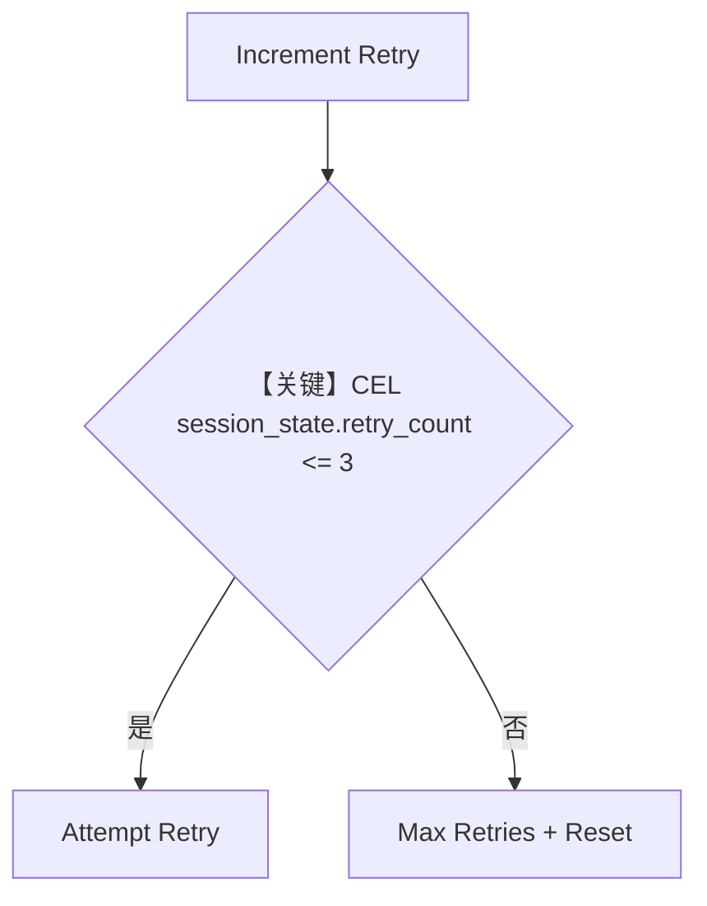

# cel_session_state.py — 实现原理分析

> 源文件：`cookbook/04_workflows/07_cel_expressions/condition/cel_session_state.py`

## 概述

本示例展示 **`session_state` 与 CEL** 结合：`increment_retry_count` 在 `session_state` 中递增 `retry_count`；`Condition` 使用 `evaluator="session_state.retry_count <= 3"` 决定走重试分支或 max retries 分支（`L74-83`）。`reset_retry_count` 在 else 链末尾清零。

**核心配置一览：**

| 配置项 | 值 |
|--------|-----|
| `Step("Increment Retry")` | `executor=increment_retry_count` |
| `evaluator` | `session_state.retry_count <= 3` |
| `retry_agent` / `max_retries_agent` | `gpt-4o-mini` |

## 核心组件解析

### increment_retry_count

`L34-41`：读/写传入的 `session_state` dict，持久化依赖 Workflow `db` 与会话（若配置）。

### 运行机制与因果链

多次 `print_response` 同 `session_id` 时计数累加，直至 CEL 走 else（见 `__main__` 后半）。

## System Prompt 组装

### Retry Handler

```text
You are handling a retry attempt. Acknowledge this is a retry and try a different approach.
```

### Max Retries Handler

```text
Maximum retries reached. Provide a helpful fallback response and suggest alternatives.
```

## Mermaid 流程图


```mermaid
flowchart TD
    I["Increment Retry"] --> C{"【关键】CEL session_state.retry_count <= 3"}
    C -->|是| R["Attempt Retry"]
    C -->|否| M["Max Retries + Reset"]
```

## 关键源码文件索引

| 文件 | 作用 |
|------|------|
| `agno/workflow/condition.py` | CEL 中 `session_state` |
| `agno/workflow/types.py` | `StepInput` / executor 与 session_state |
