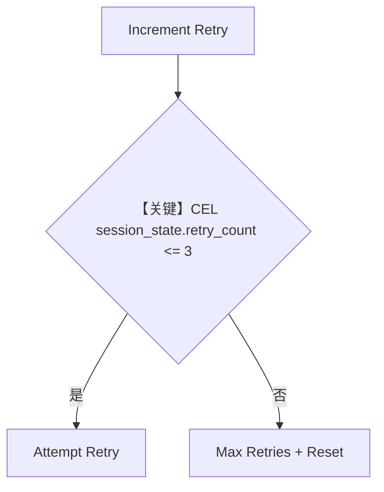

# cel_session_state.py — 实现原理分析

<!-- cookbook-py-source:start -->
## 完整源码

```python
"""Condition with CEL expression: branching on session_state.
==========================================================

Uses session_state.retry_count to implement retry logic.
Runs the workflow multiple times to show the counter incrementing
and eventually hitting the max retries branch.

Requirements:
    pip install cel-python
"""

from agno.agent import Agent
from agno.models.openai import OpenAIChat
from agno.workflow import (
    CEL_AVAILABLE,
    Condition,
    Step,
    StepInput,
    StepOutput,
    Workflow,
)

# ---------------------------------------------------------------------------
# Setup
# ---------------------------------------------------------------------------
if not CEL_AVAILABLE:
    print("CEL is not available. Install with: pip install cel-python")
    exit(1)


# ---------------------------------------------------------------------------
# Define Helpers
# ---------------------------------------------------------------------------
def increment_retry_count(step_input: StepInput, session_state: dict) -> StepOutput:
    """Increment retry count in session state."""
    current_count = session_state.get("retry_count", 0)
    session_state["retry_count"] = current_count + 1
    return StepOutput(
        content=f"Retry count incremented to {session_state['retry_count']}",
        success=True,
    )


def reset_retry_count(step_input: StepInput, session_state: dict) -> StepOutput:
    """Reset retry count in session state."""
    session_state["retry_count"] = 0
    return StepOutput(content="Retry count reset to 0", success=True)


# ---------------------------------------------------------------------------
# Create Agents
# ---------------------------------------------------------------------------
retry_agent = Agent(
    name="Retry Handler",
    model=OpenAIChat(id="gpt-4o-mini"),
    instructions="You are handling a retry attempt. Acknowledge this is a retry and try a different approach.",
    markdown=True,
)

max_retries_agent = Agent(
    name="Max Retries Handler",
    model=OpenAIChat(id="gpt-4o-mini"),
    instructions="Maximum retries reached. Provide a helpful fallback response and suggest alternatives.",
    markdown=True,
)

# ---------------------------------------------------------------------------
# Create Workflow
# ---------------------------------------------------------------------------
workflow = Workflow(
    name="CEL Retry Logic",
    steps=[
        Step(name="Increment Retry", executor=increment_retry_count),
        Condition(
            name="Retry Check",
            evaluator="session_state.retry_count <= 3",
            steps=[
                Step(name="Attempt Retry", agent=retry_agent),
            ],
            else_steps=[
                Step(name="Max Retries Reached", agent=max_retries_agent),
                Step(name="Reset Counter", executor=reset_retry_count),
            ],
        ),
    ],
    session_state={"retry_count": 0},
)

# ---------------------------------------------------------------------------
# Run Workflow
# ---------------------------------------------------------------------------
if __name__ == "__main__":
    for attempt in range(1, 6):
        print(f"--- Attempt {attempt} ---")
        workflow.print_response(
            input=f"Process request (attempt {attempt})",
            stream=True,
        )
        print()
```

<!-- cookbook-py-source:end -->

> 源文件：`cookbook/04_workflows/07_cel_expressions/condition/cel_session_state.py`

## 概述

本示例展示 **`session_state` 与 CEL** 结合：`increment_retry_count` 在 `session_state` 中递增 `retry_count`；`Condition` 使用 `evaluator="session_state.retry_count <= 3"` 决定走重试分支或 max retries 分支（`L74-83`）。`reset_retry_count` 在 else 链末尾清零。

**核心配置一览：**

| 配置项 | 值 |
|--------|-----|
| `Step("Increment Retry")` | `executor=increment_retry_count` |
| `evaluator` | `session_state.retry_count <= 3` |
| `retry_agent` / `max_retries_agent` | `gpt-4o-mini` |

## 核心组件解析

### increment_retry_count

`L34-41`：读/写传入的 `session_state` dict，持久化依赖 Workflow `db` 与会话（若配置）。

### 运行机制与因果链

多次 `print_response` 同 `session_id` 时计数累加，直至 CEL 走 else（见 `__main__` 后半）。

## System Prompt 组装

### Retry Handler

```text
You are handling a retry attempt. Acknowledge this is a retry and try a different approach.
```

### Max Retries Handler

```text
Maximum retries reached. Provide a helpful fallback response and suggest alternatives.
```

## Mermaid 流程图


```mermaid
flowchart TD
    I["Increment Retry"] --> C{"【关键】CEL session_state.retry_count <= 3"}
    C -->|是| R["Attempt Retry"]
    C -->|否| M["Max Retries + Reset"]
```

## 关键源码文件索引

| 文件 | 作用 |
|------|------|
| `agno/workflow/condition.py` | CEL 中 `session_state` |
| `agno/workflow/types.py` | `StepInput` / executor 与 session_state |
