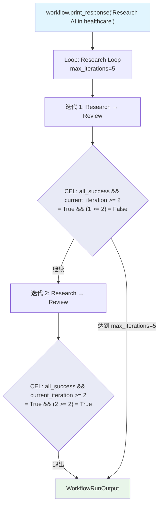

# cel_compound_exit.py — 实现原理分析

> 源文件：`cookbook/04_workflows/07_cel_expressions/loop/cel_compound_exit.py`

## 概述

本示例展示 Agno Workflow **`Loop` 使用 CEL 复合条件作为 `end_condition`**：将多个 CEL 变量通过 `&&` 组合，同时满足「所有步骤成功」和「已运行足够迭代次数」两个条件时才退出循环，实现精确的多条件退出控制。

**核心配置一览：**

| 配置项 | 值 | 说明 |
|--------|------|------|
| `end_condition` | `"all_success && current_iteration >= 2"` | CEL 复合条件 |
| `max_iterations` | `5` | 最大迭代次数上限 |
| `all_success` | `bool` | 当前迭代所有步骤成功 |
| `current_iteration` | `int` | 从 1 开始的当前迭代数 |

## 核心组件解析

### CEL 复合退出条件

```python
Loop(
    name="Research Loop",
    max_iterations=5,
    end_condition="all_success && current_iteration >= 2",  # 两个条件同时满足
    steps=[
        Step(name="Research", agent=researcher),
        Step(name="Review", agent=reviewer),
    ],
)
```

**退出逻辑**：
- 第 1 次迭代：`current_iteration=1`，即使 `all_success=True` 也不退出（`1 >= 2` 为 False）
- 第 2+ 次迭代且步骤成功：`all_success=True && current_iteration >= 2` → 退出
- 达到 `max_iterations=5`：强制退出（无论条件）

### CEL Loop 可用变量

| 变量 | 类型 | 说明 |
|------|------|------|
| `all_success` | `bool` | 当前迭代所有步骤 `success=True` |
| `current_iteration` | `int` | 当前迭代次数（从 1 开始） |
| `outputs` | `list` | 当前迭代的所有 StepOutput 列表 |
| `previous_step_content` | `string` | 最后步骤的输出内容 |

### 复合条件变体

```cel
# 至少 3 次成功迭代
all_success && current_iteration >= 3

# 最后一步输出足够长
previous_step_content.length() > 500 && current_iteration >= 2

# 任意迭代次数就退出（最少完成 1 次）
all_success && current_iteration >= 1
```

## Mermaid 流程图



## 关键源码文件索引

| 文件 | 关键类/函数 | 作用 |
|------|------------|------|
| `agno/workflow/loop.py` | `Loop.end_condition` | 支持 str 类型 CEL 表达式 |
| `agno/workflow/cel.py` | CEL 上下文构建 | `all_success`, `current_iteration` 等变量注入 |
