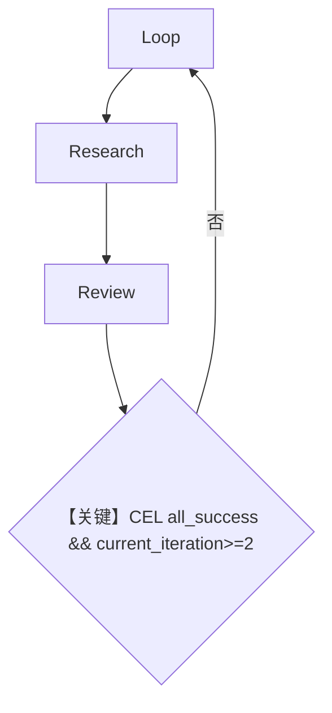

# cel_compound_exit.py — 实现原理分析

> 源文件：`cookbook/04_workflows/07_cel_expressions/loop/cel_compound_exit.py`

## 概述

本示例展示 **`Loop.end_condition` 为 CEL 复合表达式**：`all_success && current_iteration >= 2` 要求本轮全部成功且至少完成两轮迭代才结束（`L48`）。变量语义见 `loop.py` 文档字符串（`current_iteration`、`all_success` 等）。

**核心配置一览：**

| 配置项 | 值 |
|--------|-----|
| `max_iterations` | `5` |
| `end_condition` | `all_success && current_iteration >= 2` |
| 循环体 | `Research` → `Review` 两步 |

## System Prompt 组装

### Researcher

```text
Research the given topic and provide detailed findings.
```

### Reviewer

```text
Review the research for completeness and accuracy.
```

## Mermaid 流程图


```mermaid
flowchart TD
    L["Loop"] --> R["Research"]
    R --> V["Review"]
    V --> E{"【关键】CEL all_success && current_iteration>=2"}
    E -->|否| L
```

## 关键源码文件索引

| 文件 | 作用 |
|------|------|
| `agno/workflow/loop.py` | CEL `end_condition` 说明 L43-60 |
| `agno/workflow/cel.py` | `evaluate_cel_loop_end_condition` |
