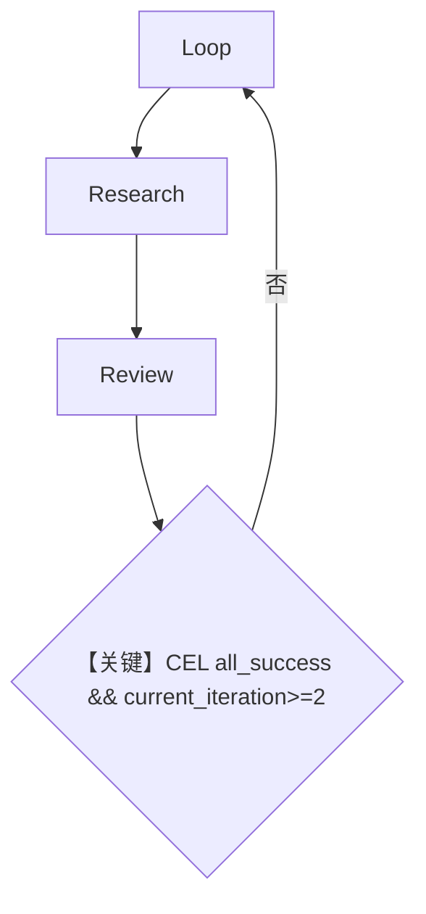

# cel_compound_exit.py — 实现原理分析

<!-- cookbook-py-source:start -->
## 完整源码

```python
"""Loop with CEL end condition: compound exit condition.
=====================================================

Combines all_success and current_iteration to stop when both
conditions are met: all steps succeeded AND enough iterations ran.

Requirements:
    pip install cel-python
"""

from agno.agent import Agent
from agno.models.openai import OpenAIChat
from agno.workflow import CEL_AVAILABLE, Loop, Step, Workflow

# ---------------------------------------------------------------------------
# Setup
# ---------------------------------------------------------------------------
if not CEL_AVAILABLE:
    print("CEL is not available. Install with: pip install cel-python")
    exit(1)

# ---------------------------------------------------------------------------
# Create Agents
# ---------------------------------------------------------------------------
researcher = Agent(
    name="Researcher",
    model=OpenAIChat(id="gpt-4o-mini"),
    instructions="Research the given topic and provide detailed findings.",
    markdown=True,
)

reviewer = Agent(
    name="Reviewer",
    model=OpenAIChat(id="gpt-4o-mini"),
    instructions="Review the research for completeness and accuracy.",
    markdown=True,
)

# ---------------------------------------------------------------------------
# Create Workflow
# ---------------------------------------------------------------------------
workflow = Workflow(
    name="CEL Compound Exit Loop",
    steps=[
        Loop(
            name="Research Loop",
            max_iterations=5,
            end_condition="all_success && current_iteration >= 2",
            steps=[
                Step(name="Research", agent=researcher),
                Step(name="Review", agent=reviewer),
            ],
        ),
    ],
)

# ---------------------------------------------------------------------------
# Run Workflow
# ---------------------------------------------------------------------------
if __name__ == "__main__":
    print("Loop with CEL end condition: all_success && current_iteration >= 2")
    print("=" * 60)
    workflow.print_response(
        input="Research the impact of AI on healthcare",
        stream=True,
    )
```

<!-- cookbook-py-source:end -->

> 源文件：`cookbook/04_workflows/07_cel_expressions/loop/cel_compound_exit.py`

## 概述

本示例展示 **`Loop.end_condition` 为 CEL 复合表达式**：`all_success && current_iteration >= 2` 要求本轮全部成功且至少完成两轮迭代才结束（`L48`）。变量语义见 `loop.py` 文档字符串（`current_iteration`、`all_success` 等）。

**核心配置一览：**

| 配置项 | 值 |
|--------|-----|
| `max_iterations` | `5` |
| `end_condition` | `all_success && current_iteration >= 2` |
| 循环体 | `Research` → `Review` 两步 |

## System Prompt 组装

### Researcher

```text
Research the given topic and provide detailed findings.
```

### Reviewer

```text
Review the research for completeness and accuracy.
```

## Mermaid 流程图


```mermaid
flowchart TD
    L["Loop"] --> R["Research"]
    R --> V["Review"]
    V --> E{"【关键】CEL all_success && current_iteration>=2"}
    E -->|否| L
```

## 关键源码文件索引

| 文件 | 作用 |
|------|------|
| `agno/workflow/loop.py` | CEL `end_condition` 说明 L43-60 |
| `agno/workflow/cel.py` | `evaluate_cel_loop_end_condition` |
