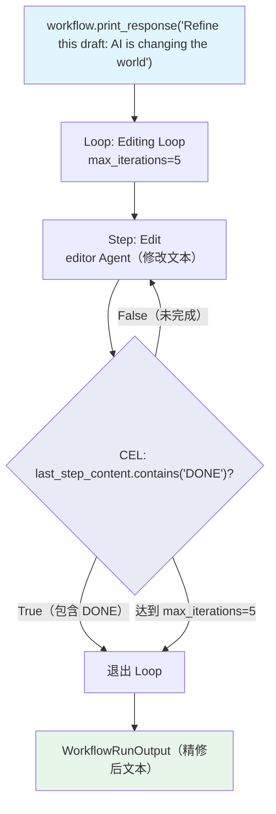

# cel_content_keyword.py — 实现原理分析

> 源文件：`cookbook/04_workflows/07_cel_expressions/loop/cel_content_keyword.py`

## 概述

本示例展示 Agno Workflow **`Loop` 使用 CEL `last_step_content.contains()` 检测 Agent 输出关键词作为退出条件**：Agent 在输出完善的内容时主动包含关键词 "DONE"，CEL 表达式检测到该关键词后退出循环，无需外部 Python 函数判断，实现 Agent 信号驱动的自退出循环。

**核心配置一览：**

| 配置项 | 值 | 说明 |
|--------|------|------|
| `end_condition` | `'last_step_content.contains("DONE")'` | CEL 检测关键词 |
| `last_step_content` | 最后步骤输出内容 | CEL Loop 特有变量 |
| Agent 协议 | 输出满足时包含 "DONE" | Agent 主动发送完成信号 |
| `max_iterations` | `5` | 防止无限循环 |

## 核心组件解析

### Agent 信号协议

```python
editor = Agent(
    name="Editor",
    instructions=(
        "Edit and refine the text. When the text is polished and ready, "
        "include the word DONE at the end of your response."   # Agent 主动发送完成信号
    ),
)
```

### CEL 关键词检测 end_condition

```python
Loop(
    name="Editing Loop",
    max_iterations=5,
    end_condition='last_step_content.contains("DONE")',   # CEL 检测 "DONE" 关键词
    steps=[
        Step(name="Edit", agent=editor),
    ],
)
```

### vs Python end_condition 对比

```python
# Python 函数方式
def is_complete(outputs: List[StepOutput]) -> bool:
    return any("DONE" in (o.content or "") for o in outputs)

# CEL 方式（等价，一行完成）
end_condition='last_step_content.contains("DONE")'
```

## Loop CEL 可用变量

| 变量 | 说明 |
|------|------|
| `last_step_content` | 当前迭代最后一步的输出内容 |
| `previous_step_content` | 前驱步骤输出（同 `last_step_content`） |
| `all_success` | 当前迭代所有步骤是否成功 |
| `current_iteration` | 当前迭代次数（从 1 开始） |

## Mermaid 流程图



## 关键源码文件索引

| 文件 | 关键类/函数 | 作用 |
|------|------------|------|
| `agno/workflow/loop.py` | `Loop.end_condition` | 支持 str CEL 表达式 |
| `agno/workflow/cel.py` | CEL 上下文 | 注入 `last_step_content` 变量 |
