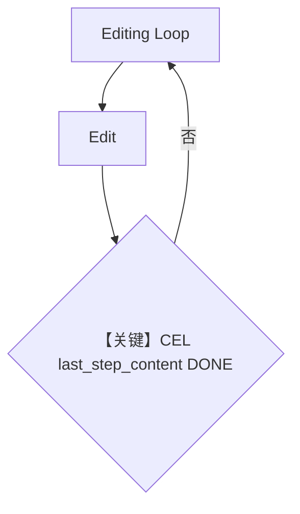

# cel_content_keyword.py — 实现原理分析

> 源文件：`cookbook/04_workflows/07_cel_expressions/loop/cel_content_keyword.py`

## 概述

本示例展示 **CEL 循环结束条件 `last_step_content.contains("DONE")`**：单步 `Edit` Agent 被指示在润色完成时在回复末尾包含 `DONE`，CEL 检测该关键词以退出循环（`L44-47`）。

**核心配置一览：**

| 配置项 | 值 |
|--------|-----|
| `end_condition` | `'last_step_content.contains("DONE")'` |
| `max_iterations` | `5` |
| `editor` instructions | 要求输出含 `DONE` |

## System Prompt 组装

```text
Edit and refine the text. When the text is polished and ready, include the word DONE at the end of your response.
```

## Mermaid 流程图


```mermaid
flowchart TD
    L["Editing Loop"] --> E["Edit"]
    E --> C{"【关键】CEL last_step_content DONE"}
    C -->|否| L
```

## 关键源码文件索引

| 文件 | 作用 |
|------|------|
| `agno/workflow/loop.py` | `last_step_content` CEL 变量 |
