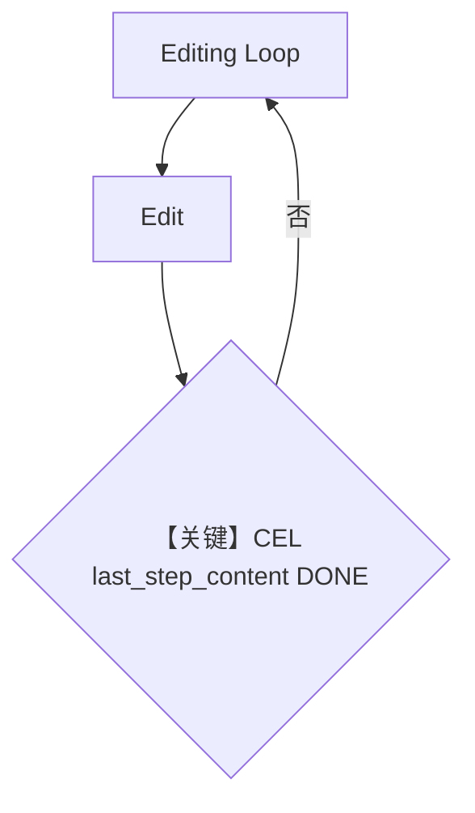

# cel_content_keyword.py — 实现原理分析

<!-- cookbook-py-source:start -->
## 完整源码

```python
"""Loop with CEL end condition: stop when agent signals completion.
================================================================

Uses last_step_content.contains() to detect a keyword in the output
that signals the loop should stop.

Requirements:
    pip install cel-python
"""

from agno.agent import Agent
from agno.models.openai import OpenAIChat
from agno.workflow import CEL_AVAILABLE, Loop, Step, Workflow

# ---------------------------------------------------------------------------
# Setup
# ---------------------------------------------------------------------------
if not CEL_AVAILABLE:
    print("CEL is not available. Install with: pip install cel-python")
    exit(1)

# ---------------------------------------------------------------------------
# Create Agent
# ---------------------------------------------------------------------------
editor = Agent(
    name="Editor",
    model=OpenAIChat(id="gpt-4o-mini"),
    instructions=(
        "Edit and refine the text. When the text is polished and ready, "
        "include the word DONE at the end of your response."
    ),
    markdown=True,
)

# ---------------------------------------------------------------------------
# Create Workflow
# ---------------------------------------------------------------------------
workflow = Workflow(
    name="CEL Content Keyword Loop",
    steps=[
        Loop(
            name="Editing Loop",
            max_iterations=5,
            end_condition='last_step_content.contains("DONE")',
            steps=[
                Step(name="Edit", agent=editor),
            ],
        ),
    ],
)

# ---------------------------------------------------------------------------
# Run Workflow
# ---------------------------------------------------------------------------
if __name__ == "__main__":
    print('Loop with CEL end condition: last_step_content.contains("DONE")')
    print("=" * 60)
    workflow.print_response(
        input="Refine this draft: AI is changing the world in many ways.",
        stream=True,
    )
```

<!-- cookbook-py-source:end -->

> 源文件：`cookbook/04_workflows/07_cel_expressions/loop/cel_content_keyword.py`

## 概述

本示例展示 **CEL 循环结束条件 `last_step_content.contains("DONE")`**：单步 `Edit` Agent 被指示在润色完成时在回复末尾包含 `DONE`，CEL 检测该关键词以退出循环（`L44-47`）。

**核心配置一览：**

| 配置项 | 值 |
|--------|-----|
| `end_condition` | `'last_step_content.contains("DONE")'` |
| `max_iterations` | `5` |
| `editor` instructions | 要求输出含 `DONE` |

## System Prompt 组装

```text
Edit and refine the text. When the text is polished and ready, include the word DONE at the end of your response.
```

## Mermaid 流程图


```mermaid
flowchart TD
    L["Editing Loop"] --> E["Edit"]
    E --> C{"【关键】CEL last_step_content DONE"}
    C -->|否| L
```

## 关键源码文件索引

| 文件 | 作用 |
|------|------|
| `agno/workflow/loop.py` | `last_step_content` CEL 变量 |
