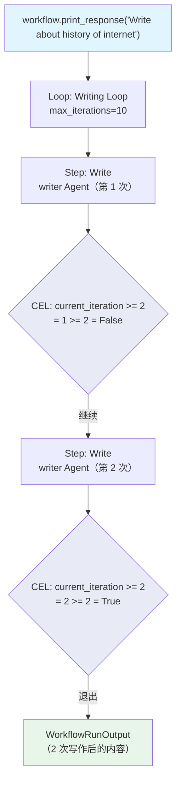

# cel_iteration_limit.py — 实现原理分析

> 源文件：`cookbook/04_workflows/07_cel_expressions/loop/cel_iteration_limit.py`

## 概述

本示例展示 Agno Workflow **`Loop` 使用 CEL `current_iteration >= N` 精确控制迭代次数**：通过 `end_condition="current_iteration >= 2"` 在恰好 2 次迭代后退出循环，`max_iterations=10` 作为安全上限，两者配合实现「至少 N 次、最多 M 次」的精确迭代控制。

**核心配置一览：**

| 配置项 | 值 | 说明 |
|--------|------|------|
| `end_condition` | `"current_iteration >= 2"` | 精确控制退出次数 |
| `max_iterations` | `10` | 安全上限（防止无限循环） |
| 实际执行 | 恰好 2 次迭代 | 两者取最小值 |

## 核心组件解析

### CEL 迭代次数控制

```python
Loop(
    name="Writing Loop",
    max_iterations=10,                          # 安全上限
    end_condition="current_iteration >= 2",     # 精确退出：≥ 2 次后退出
    steps=[
        Step(name="Write", agent=writer),
    ],
)
```

### 与 max_iterations 的关系

| 配置组合 | 效果 |
|---------|------|
| `end_condition="current_iteration >= 2"` + `max_iterations=10` | 2 次退出（end_condition 先满足） |
| `end_condition="current_iteration >= 15"` + `max_iterations=10` | 10 次退出（max_iterations 先触发） |
| 仅 `max_iterations=3` | 3 次退出 |

### 常见 CEL 迭代模式

```cel
# 固定次数
"current_iteration >= 3"

# 至少 2 次且全部成功
"all_success && current_iteration >= 2"

# 根据内容决定（动态）
'last_step_content.contains("DONE")'
```

## Mermaid 流程图



## 关键源码文件索引

| 文件 | 关键类/函数 | 作用 |
|------|------------|------|
| `agno/workflow/loop.py` | `Loop.end_condition` | 支持 str CEL 表达式 |
| `agno/workflow/cel.py` | CEL 上下文 | 注入 `current_iteration` 变量 |
| `agno/workflow/loop.py` | `Loop.max_iterations` | 安全上限，防止无限循环 |
