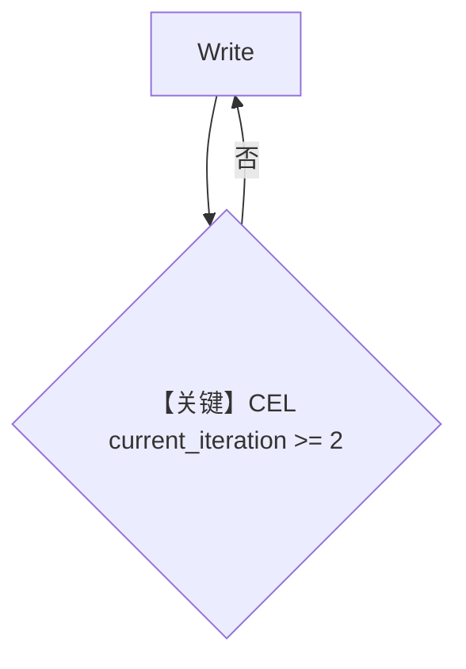

# cel_iteration_limit.py — 实现原理分析

> 源文件：`cookbook/04_workflows/07_cel_expressions/loop/cel_iteration_limit.py`

## 概述

本示例展示 **`current_iteration >= 2` 提前结束循环**，即使 `max_iterations=10`（`L40-42`）：CEL 在达到迭代次数阈值时返回真，`end_condition` 满足则不再继续。

**核心配置一览：**

| 配置项 | 值 |
|--------|-----|
| `max_iterations` | `10` |
| `end_condition` | `current_iteration >= 2` |
| 单步 | `Write` + `writer` |

## System Prompt 组装

```text
Write a short paragraph expanding on the topic. Build on previous content.
```

## Mermaid 流程图


```mermaid
flowchart TD
    W["Write"] --> X{"【关键】CEL current_iteration >= 2"}
    X -->|否| W
```

## 关键源码文件索引

| 文件 | 作用 |
|------|------|
| `agno/workflow/loop.py` | `current_iteration` / `max_iterations` |
