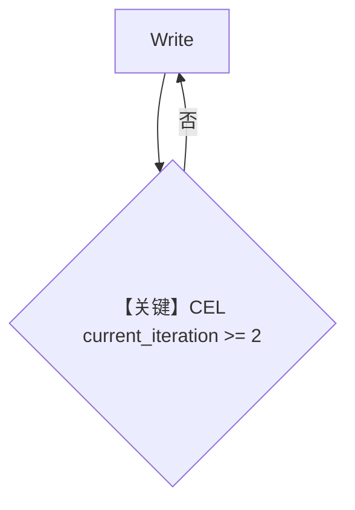

# cel_iteration_limit.py — 实现原理分析

<!-- cookbook-py-source:start -->
## 完整源码

```python
"""Loop with CEL end condition: stop after N iterations.
=====================================================

Uses current_iteration to stop after a specific number
of iterations, independent of max_iterations.

Requirements:
    pip install cel-python
"""

from agno.agent import Agent
from agno.models.openai import OpenAIChat
from agno.workflow import CEL_AVAILABLE, Loop, Step, Workflow

# ---------------------------------------------------------------------------
# Setup
# ---------------------------------------------------------------------------
if not CEL_AVAILABLE:
    print("CEL is not available. Install with: pip install cel-python")
    exit(1)

# ---------------------------------------------------------------------------
# Create Agent
# ---------------------------------------------------------------------------
writer = Agent(
    name="Writer",
    model=OpenAIChat(id="gpt-4o-mini"),
    instructions="Write a short paragraph expanding on the topic. Build on previous content.",
    markdown=True,
)

# ---------------------------------------------------------------------------
# Create Workflow
# ---------------------------------------------------------------------------
workflow = Workflow(
    name="CEL Iteration Limit Loop",
    steps=[
        Loop(
            name="Writing Loop",
            max_iterations=10,
            # Stop after 2 iterations even though max is 10
            end_condition="current_iteration >= 2",
            steps=[
                Step(name="Write", agent=writer),
            ],
        ),
    ],
)

# ---------------------------------------------------------------------------
# Run Workflow
# ---------------------------------------------------------------------------
if __name__ == "__main__":
    print("Loop with CEL end condition: current_iteration >= 2 (max_iterations=10)")
    print("=" * 60)
    workflow.print_response(
        input="Write about the history of the internet",
        stream=True,
    )
```

<!-- cookbook-py-source:end -->

> 源文件：`cookbook/04_workflows/07_cel_expressions/loop/cel_iteration_limit.py`

## 概述

本示例展示 **`current_iteration >= 2` 提前结束循环**，即使 `max_iterations=10`（`L40-42`）：CEL 在达到迭代次数阈值时返回真，`end_condition` 满足则不再继续。

**核心配置一览：**

| 配置项 | 值 |
|--------|-----|
| `max_iterations` | `10` |
| `end_condition` | `current_iteration >= 2` |
| 单步 | `Write` + `writer` |

## System Prompt 组装

```text
Write a short paragraph expanding on the topic. Build on previous content.
```

## Mermaid 流程图


```mermaid
flowchart TD
    W["Write"] --> X{"【关键】CEL current_iteration >= 2"}
    X -->|否| W
```

## 关键源码文件索引

| 文件 | 作用 |
|------|------|
| `agno/workflow/loop.py` | `current_iteration` / `max_iterations` |
