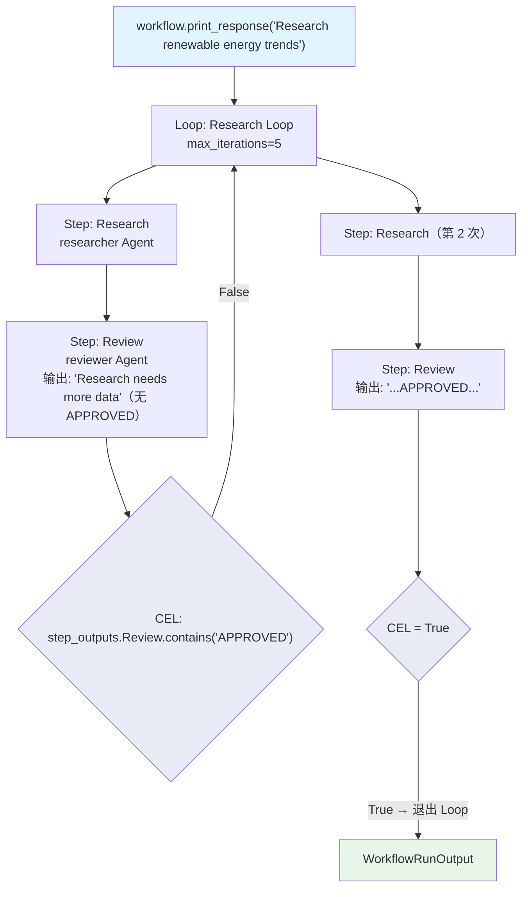

# cel_step_outputs_check.py — 实现原理分析

> 源文件：`cookbook/04_workflows/07_cel_expressions/loop/cel_step_outputs_check.py`

## 概述

本示例展示 Agno Workflow **Loop CEL `end_condition` 通过 `step_outputs` Map 按步骤名检查特定步骤输出**：`step_outputs.Review.contains("APPROVED")` 直接访问名为 "Review" 的步骤的输出，实现由特定步骤的审核结果控制的循环退出。

**核心配置一览：**

| 配置项 | 值 | 说明 |
|--------|------|------|
| CEL 变量 | `step_outputs` | Loop 当前迭代各步骤输出的 Map |
| 访问语法 | `step_outputs.StepName` | 按步骤名访问 |
| Agent 协议 | 输出通过时包含 "APPROVED" | 审核者主动发送批准信号 |

## 核心组件解析

### CEL step_outputs 按步骤名检查

```python
Loop(
    name="Research Loop",
    max_iterations=5,
    end_condition='step_outputs.Review.contains("APPROVED")',  # 检查 "Review" 步骤输出
    steps=[
        Step(name="Research", agent=researcher),
        Step(name="Review", agent=reviewer),   # 步骤名: "Review"
    ],
)
```

### Reviewer Agent 发送批准信号

```python
reviewer = Agent(
    instructions=(
        "Review the research. If the research is thorough and complete, "
        "include APPROVED in your response."   # 通过时包含 "APPROVED"
    ),
)
```

### step_outputs vs previous_step_outputs

| 变量 | 作用域 | 说明 |
|------|-------|------|
| `step_outputs` | Loop `end_condition` 中 | 当前迭代所有步骤的输出 |
| `previous_step_outputs` | Condition/Router 的 CEL 中 | 所有前驱步骤的输出 |

## Mermaid 流程图



## 关键源码文件索引

| 文件 | 关键类/函数 | 作用 |
|------|------------|------|
| `agno/workflow/cel.py` | CEL 上下文 | 注入 `step_outputs` Map |
| `agno/workflow/loop.py` | `Loop.end_condition` | 支持 str CEL 表达式 |
