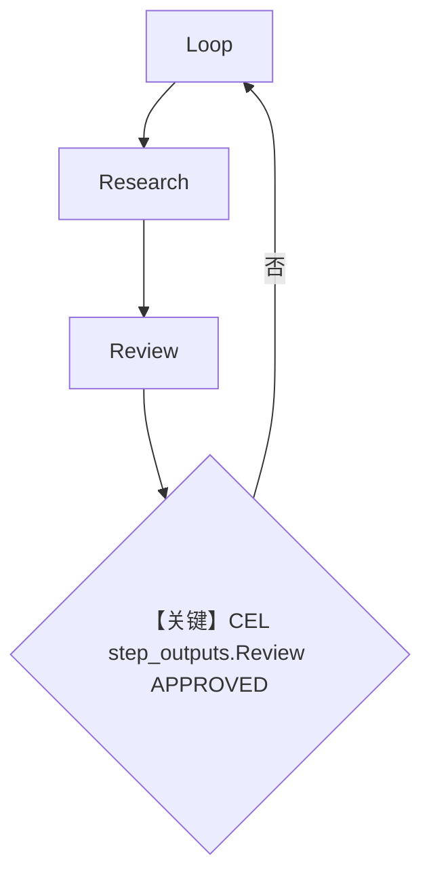

# cel_step_outputs_check.py — 实现原理分析

<!-- cookbook-py-source:start -->
## 完整源码

```python
"""Loop with CEL end condition: check a named step's output.
=========================================================

Uses step_outputs map to access a specific step by name and
check its content before deciding to stop the loop.

Requirements:
    pip install cel-python
"""

from agno.agent import Agent
from agno.models.openai import OpenAIChat
from agno.workflow import CEL_AVAILABLE, Loop, Step, Workflow

# ---------------------------------------------------------------------------
# Setup
# ---------------------------------------------------------------------------
if not CEL_AVAILABLE:
    print("CEL is not available. Install with: pip install cel-python")
    exit(1)

# ---------------------------------------------------------------------------
# Create Agents
# ---------------------------------------------------------------------------
researcher = Agent(
    name="Researcher",
    model=OpenAIChat(id="gpt-4o-mini"),
    instructions="Research the given topic.",
    markdown=True,
)

reviewer = Agent(
    name="Reviewer",
    model=OpenAIChat(id="gpt-4o-mini"),
    instructions=(
        "Review the research. If the research is thorough and complete, "
        "include APPROVED in your response."
    ),
    markdown=True,
)

# ---------------------------------------------------------------------------
# Create Workflow
# ---------------------------------------------------------------------------
workflow = Workflow(
    name="CEL Step Outputs Check Loop",
    steps=[
        Loop(
            name="Research Loop",
            max_iterations=5,
            # Stop when the Reviewer step approves the research
            end_condition='step_outputs.Review.contains("APPROVED")',
            steps=[
                Step(name="Research", agent=researcher),
                Step(name="Review", agent=reviewer),
            ],
        ),
    ],
)

# ---------------------------------------------------------------------------
# Run Workflow
# ---------------------------------------------------------------------------
if __name__ == "__main__":
    print('Loop with CEL end condition: step_outputs.Review.contains("APPROVED")')
    print("=" * 60)
    workflow.print_response(
        input="Research renewable energy trends",
        stream=True,
    )
```

<!-- cookbook-py-source:end -->

> 源文件：`cookbook/04_workflows/07_cel_expressions/loop/cel_step_outputs_check.py`

## 概述

本示例展示 **CEL 循环结束条件使用 `step_outputs.<Name>`**：`step_outputs.Review.contains("APPROVED")` 在本轮 `Review` 步输出含批准标记时结束循环（`L51-55`）。与 Condition 中的 `previous_step_outputs` 对照：`loop.py` 文档使用 `step_outputs` 表示**当前迭代**映射。

**核心配置一览：**

| 配置项 | 值 |
|--------|-----|
| `end_condition` | `'step_outputs.Review.contains("APPROVED")'` |
| 循环体 | `Research` → `Review` |

## System Prompt 组装

### Reviewer

```text
Review the research. If the research is thorough and complete, include APPROVED in your response.
```

## Mermaid 流程图


```mermaid
flowchart TD
    L["Loop"] --> R["Research"]
    R --> V["Review"]
    V --> C{"【关键】CEL step_outputs.Review APPROVED"}
    C -->|否| L
```

## 关键源码文件索引

| 文件 | 作用 |
|------|------|
| `agno/workflow/loop.py` | `step_outputs` CEL 变量 |
