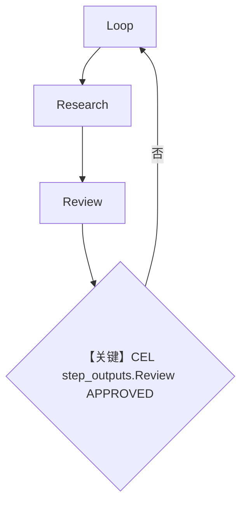

# cel_step_outputs_check.py — 实现原理分析

> 源文件：`cookbook/04_workflows/07_cel_expressions/loop/cel_step_outputs_check.py`

## 概述

本示例展示 **CEL 循环结束条件使用 `step_outputs.<Name>`**：`step_outputs.Review.contains("APPROVED")` 在本轮 `Review` 步输出含批准标记时结束循环（`L51-55`）。与 Condition 中的 `previous_step_outputs` 对照：`loop.py` 文档使用 `step_outputs` 表示**当前迭代**映射。

**核心配置一览：**

| 配置项 | 值 |
|--------|-----|
| `end_condition` | `'step_outputs.Review.contains("APPROVED")'` |
| 循环体 | `Research` → `Review` |

## System Prompt 组装

### Reviewer

```text
Review the research. If the research is thorough and complete, include APPROVED in your response.
```

## Mermaid 流程图


```mermaid
flowchart TD
    L["Loop"] --> R["Research"]
    R --> V["Review"]
    V --> C{"【关键】CEL step_outputs.Review APPROVED"}
    C -->|否| L
```

## 关键源码文件索引

| 文件 | 作用 |
|------|------|
| `agno/workflow/loop.py` | `step_outputs` CEL 变量 |
