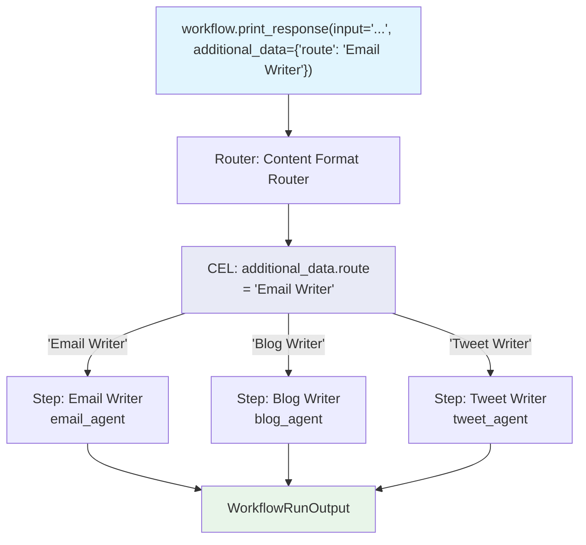

# cel_additional_data_route.py — 实现原理分析

> 源文件：`cookbook/04_workflows/07_cel_expressions/router/cel_additional_data_route.py`

## 概述

本示例展示 Agno Workflow **`Router` 使用 CEL 读取 `additional_data.route` 实现调用方指定路由**：调用方在 `additional_data={"route": "Email Writer"}` 中明确指定路由目标，CEL 表达式 `"additional_data.route"` 直接返回该字段值作为步骤名称，Router 按名称查找并执行对应步骤，实现外部驱动的路由（如 UI 前端）。

**核心配置一览：**

| 配置项 | 值 | 说明 |
|--------|------|------|
| `selector` | `"additional_data.route"` | 读取 additional_data 字段 |
| `additional_data.route` 值 | `"Email Writer"` 等步骤名 | 必须匹配 choices 中的 `name` |
| 路由触发方 | 调用方（UI/API） | 外部决定路由，非 LLM 决策 |

## 核心组件解析

### CEL 直接返回步骤名

```python
Router(
    name="Content Format Router",
    selector="additional_data.route",  # CEL：直接读取字段值作为步骤名
    choices=[
        Step(name="Email Writer", agent=email_agent),
        Step(name="Blog Writer", agent=blog_agent),
        Step(name="Tweet Writer", agent=tweet_agent),
    ],
)
```

### 调用方指定路由

```python
# UI 前端选择了 Email → 传入 additional_data
workflow.print_response(
    input="Write about our new product launch.",
    additional_data={"route": "Email Writer"},  # 必须与 choices 中的 name 完全匹配
)

# 选择 Tweet
workflow.print_response(
    input="Write about our new product launch.",
    additional_data={"route": "Tweet Writer"},
)
```

## 适用场景

| 场景 | 说明 |
|------|------|
| UI 驱动路由 | 前端下拉菜单选择内容格式 |
| API 参数路由 | 上游系统传入路由决策 |
| A/B 测试 | 通过 additional_data 控制执行路径 |
| 批处理 | 不同记录指定不同处理路径 |

## vs Python selector 对比

```python
# Python 函数方式
def content_type_router(step_input: StepInput) -> str:
    return step_input.additional_data.get("route", "Blog Writer")

# CEL 方式（一行，无需函数）
selector="additional_data.route"
```

## Mermaid 流程图



## 关键源码文件索引

| 文件 | 关键类/函数 | 作用 |
|------|------------|------|
| `agno/workflow/cel.py` | CEL 上下文 | 注入 `additional_data` 变量 |
| `agno/workflow/router.py` | `Router.selector` | 支持 str CEL，返回步骤名称 |
