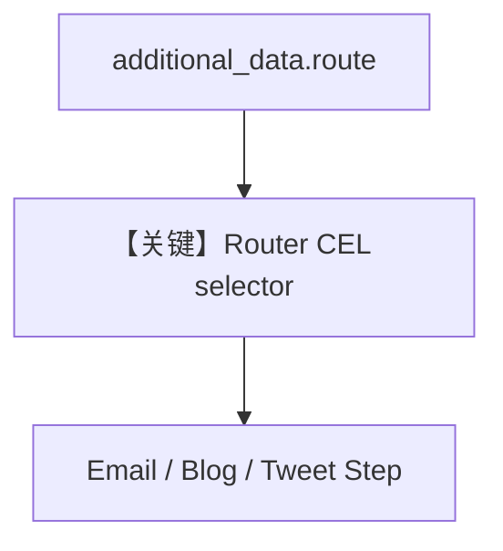

# cel_additional_data_route.py — 实现原理分析

<!-- cookbook-py-source:start -->
## 完整源码

```python
"""Router with CEL expression: route from additional_data field.
=============================================================

Uses additional_data.route to let the caller specify which step
to run, useful when the routing decision is made upstream (e.g. UI).

Requirements:
    pip install cel-python
"""

from agno.agent import Agent
from agno.models.openai import OpenAIChat
from agno.workflow import CEL_AVAILABLE, Step, Workflow
from agno.workflow.router import Router

# ---------------------------------------------------------------------------
# Setup
# ---------------------------------------------------------------------------
if not CEL_AVAILABLE:
    print("CEL is not available. Install with: pip install cel-python")
    exit(1)

# ---------------------------------------------------------------------------
# Create Agents
# ---------------------------------------------------------------------------
email_agent = Agent(
    name="Email Writer",
    model=OpenAIChat(id="gpt-4o-mini"),
    instructions="You write professional emails. Be concise and polished.",
    markdown=True,
)

blog_agent = Agent(
    name="Blog Writer",
    model=OpenAIChat(id="gpt-4o-mini"),
    instructions="You write engaging blog posts with clear structure and headings.",
    markdown=True,
)

tweet_agent = Agent(
    name="Tweet Writer",
    model=OpenAIChat(id="gpt-4o-mini"),
    instructions="You write punchy tweets. Keep it under 280 characters.",
    markdown=True,
)

# ---------------------------------------------------------------------------
# Create Workflow
# ---------------------------------------------------------------------------
workflow = Workflow(
    name="CEL Additional Data Router",
    steps=[
        Router(
            name="Content Format Router",
            selector="additional_data.route",
            choices=[
                Step(name="Email Writer", agent=email_agent),
                Step(name="Blog Writer", agent=blog_agent),
                Step(name="Tweet Writer", agent=tweet_agent),
            ],
        ),
    ],
)

# ---------------------------------------------------------------------------
# Run Workflow
# ---------------------------------------------------------------------------
if __name__ == "__main__":
    print("--- Route to email ---")
    workflow.print_response(
        input="Write about our new product launch.",
        additional_data={"route": "Email Writer"},
    )
    print()

    print("--- Route to tweet ---")
    workflow.print_response(
        input="Write about our new product launch.",
        additional_data={"route": "Tweet Writer"},
    )
```

<!-- cookbook-py-source:end -->

> 源文件：`cookbook/04_workflows/07_cel_expressions/router/cel_additional_data_route.py`

## 概述

本示例展示 **`Router.selector` 为 CEL 字符串且返回路由键**：`selector="additional_data.route"` 从 `additional_data` 读取上游（如 UI）指定的通道名，再与 `choices` 里 `Step.name`（`Email Writer` / `Blog Writer` / `Tweet Writer`）匹配执行（`L53-60`）。

**核心配置一览：**

| 配置项 | 值 |
|--------|-----|
| `Router.selector` | `"additional_data.route"` |
| `choices` | 三步，name 与 `additional_data.route` 对齐 |

## 运行机制与因果链

`run`/`print_response` 传入 `additional_data={"route": "Blog Writer"}` 等（见 `__main__` 后半），CEL 求值得到字符串，Router 解析为待执行 Step。

## System Prompt 组装

三 Agent instructions（`L29-44`）逐字还原即可。

### 还原（Email Writer）

```text
You write professional emails. Be concise and polished.
```

## Mermaid 流程图


```mermaid
flowchart TD
    AD["additional_data.route"] --> R["【关键】Router CEL selector"]
    R --> E["Email / Blog / Tweet Step"]
```

## 关键源码文件索引

| 文件 | 作用 |
|------|------|
| `agno/workflow/router.py` | CEL `selector`；返回 step 名 |
| `agno/workflow/cel.py` | `evaluate_cel_router_selector` |
