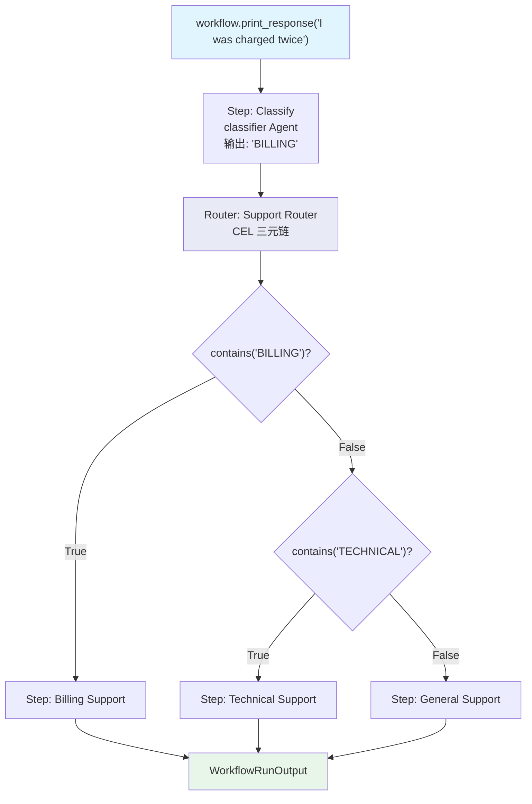

# cel_previous_step_route.py — 实现原理分析

> 源文件：`cookbook/04_workflows/07_cel_expressions/router/cel_previous_step_route.py`

## 概述

本示例展示 Agno Workflow **`Router` 使用 CEL `previous_step_outputs` Map + 三元链式运算符**实现分类器驱动路由：通过 `previous_step_outputs.Classify.contains("BILLING") ? "Billing Support" : ...` 读取命名步骤的输出并多级三元判断，实现 LLM 分类器驱动的精确路由（3 类支持分发）。

**核心配置一览：**

| 配置项 | 值 | 说明 |
|--------|------|------|
| 步骤名访问 | `previous_step_outputs.Classify` | 按名访问 "Classify" 步骤输出 |
| 三元链 | `A ? "B" : C ? "D" : "E"` | 多级条件路由 |
| 分类器输出 | 恰好一个词: BILLING/TECHNICAL/GENERAL | 严格输出控制 |

## 核心组件解析

### 分类器 Agent（严格单词输出）

```python
classifier = Agent(
    name="Classifier",
    instructions=(
        "Classify the request into exactly one category. "
        "Respond with only one word: BILLING, TECHNICAL, or GENERAL."
    ),
    markdown=False,  # 纯文本，便于 CEL 解析
)
```

### CEL 三元链路由

```python
Router(
    name="Support Router",
    selector=(
        'previous_step_outputs.Classify.contains("BILLING") ? "Billing Support" : '
        'previous_step_outputs.Classify.contains("TECHNICAL") ? "Technical Support" : '
        '"General Support"'
    ),
    choices=[
        Step(name="Billing Support", agent=billing_agent),
        Step(name="Technical Support", agent=technical_agent),
        Step(name="General Support", agent=general_agent),
    ],
)
```

### 执行流程

```
输入: "I was charged twice on my invoice."
Classify 输出: "BILLING"
CEL: previous_step_outputs.Classify.contains("BILLING") = True → "Billing Support"
→ billing_agent 执行

输入: "My API keeps returning 503 errors."
Classify 输出: "TECHNICAL"
CEL: BILLING? No → TECHNICAL? Yes → "Technical Support"
→ technical_agent 执行
```

## Mermaid 流程图



## 关键源码文件索引

| 文件 | 关键类/函数 | 作用 |
|------|------------|------|
| `agno/workflow/cel.py` | CEL 上下文 | 注入 `previous_step_outputs` Map |
| `agno/workflow/router.py` | `Router.selector` | 支持 str CEL 三元表达式 |
