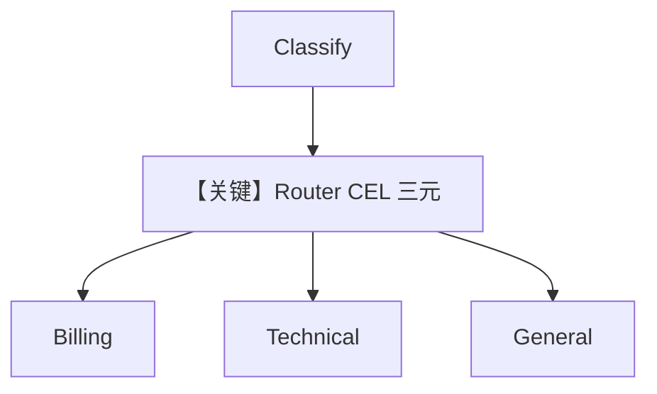

# cel_previous_step_route.py — 实现原理分析

> 源文件：`cookbook/04_workflows/07_cel_expressions/router/cel_previous_step_route.py`

## 概述

本示例展示 **嵌套 CEL 三元表达式** 根据 `previous_step_outputs.Classify` 内容选择 `"Billing Support"` / `"Technical Support"` / `"General Support"`（`L67-70`）；前序 `Classify` Step 输出单词类别（`L29-32`）。

**核心配置一览：**

| 配置项 | 值 |
|--------|-----|
| 第一步 | `Step(name="Classify", ...)` |
| `Router.selector` | 双嵌套 `? :`，含 `previous_step_outputs.Classify.contains(...)` |
| `choices` | 三步 name 与返回字符串一致 |

## System Prompt 组装

### Classifier

```text
Classify the request into exactly one category. Respond with only one word: BILLING, TECHNICAL, or GENERAL.
```

## Mermaid 流程图


```mermaid
flowchart TD
    C["Classify"] --> R["【关键】Router CEL 三元"]
    R --> B["Billing"]
    R --> T["Technical"]
    R --> G["General"]
```

## 关键源码文件索引

| 文件 | 作用 |
|------|------|
| `agno/workflow/router.py` | CEL router |
