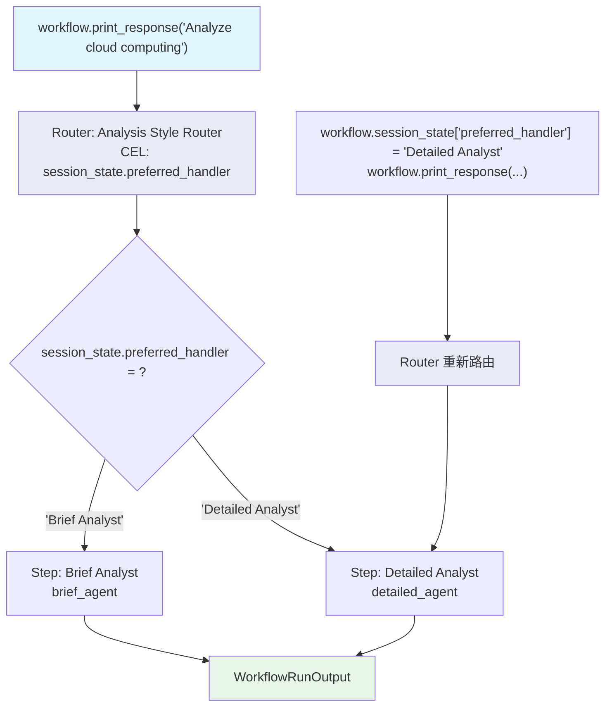

# cel_session_state_route.py — 实现原理分析

> 源文件：`cookbook/04_workflows/07_cel_expressions/router/cel_session_state_route.py`

## 概述

本示例展示 Agno Workflow **`Router` 使用 CEL `session_state` 字段实现持久化用户偏好路由**：`session_state.preferred_handler` 存储用户的首选分析师类型，CEL selector 直接读取该字段值作为步骤名，运行中可通过修改 `workflow.session_state` 改变路由偏好。

**核心配置一览：**

| 配置项 | 值 | 说明 |
|--------|------|------|
| `selector` | `"session_state.preferred_handler"` | 读取 session_state 字段作为步骤名 |
| 初始偏好 | `session_state={"preferred_handler": "Brief Analyst"}` | 默认路由目标 |
| 运行时修改 | `workflow.session_state["preferred_handler"] = "Detailed Analyst"` | 动态更改路由偏好 |

## 核心组件解析

### CEL 读取 session_state 路由

```python
workflow = Workflow(
    steps=[
        Router(
            name="Analysis Style Router",
            selector="session_state.preferred_handler",   # 直接读取字段值作为步骤名
            choices=[
                Step(name="Detailed Analyst", agent=detailed_agent),
                Step(name="Brief Analyst", agent=brief_agent),
            ],
        ),
    ],
    session_state={"preferred_handler": "Brief Analyst"},   # 初始偏好
)
```

### 动态修改路由偏好

```python
# 第一次运行：Brief Analyst（默认偏好）
workflow.print_response(input="Analyze cloud computing.")
# session_state.preferred_handler = "Brief Analyst" → brief_agent 执行

# 修改偏好
workflow.session_state["preferred_handler"] = "Detailed Analyst"

# 第二次运行：Detailed Analyst（已更新偏好）
workflow.print_response(input="Analyze cloud computing.")
# session_state.preferred_handler = "Detailed Analyst" → detailed_agent 执行
```

## 适用场景

| 场景 | 说明 |
|------|------|
| 用户配置文件路由 | 读取用户偏好设置决定路由 |
| A/B 测试 | 通过 session_state 控制实验组 |
| 自适应路由 | 根据之前的运行更新偏好 |
| 特性开关 | `session_state.feature_enabled` 控制路由 |

## Mermaid 流程图



## 关键源码文件索引

| 文件 | 关键类/函数 | 作用 |
|------|------------|------|
| `agno/workflow/cel.py` | CEL 上下文 | 注入 `session_state` Map |
| `agno/workflow/router.py` | `Router.selector` | 支持 str CEL 字段访问 |
| `agno/workflow/workflow.py` | `Workflow.session_state` | 可在运行时直接修改 |
