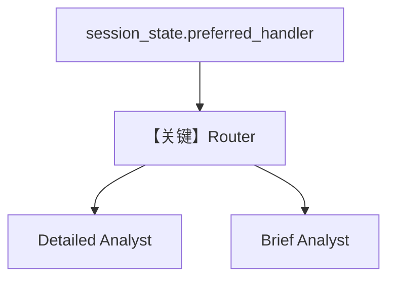

# cel_session_state_route.py — 实现原理分析

> 源文件：`cookbook/04_workflows/07_cel_expressions/router/cel_session_state_route.py`

## 概述

本示例展示 **`selector="session_state.preferred_handler"`**：`Workflow` 构造时传入 `session_state={"preferred_handler": "Brief Analyst"}`（`L55-56`），CEL 返回值须与 `Step.name` 一致；`__main__` 中修改 `workflow.session_state` 后再次 `print_response` 切换路由（`L67-69`）。

**核心配置一览：**

| 配置项 | 值 |
|--------|-----|
| `Router.selector` | `"session_state.preferred_handler"` |
| `choices` | `Detailed Analyst` / `Brief Analyst` |

## System Prompt 组装

```text
You provide detailed, in-depth analysis with examples and data.
```

与 Brief 版本见源 `L33-37`。

## Mermaid 流程图


```mermaid
flowchart TD
    S["session_state.preferred_handler"] --> R["【关键】Router"]
    R --> D["Detailed Analyst"]
    R --> B["Brief Analyst"]
```

## 关键源码文件索引

| 文件 | 作用 |
|------|------|
| `agno/workflow/router.py` | CEL + session_state |
