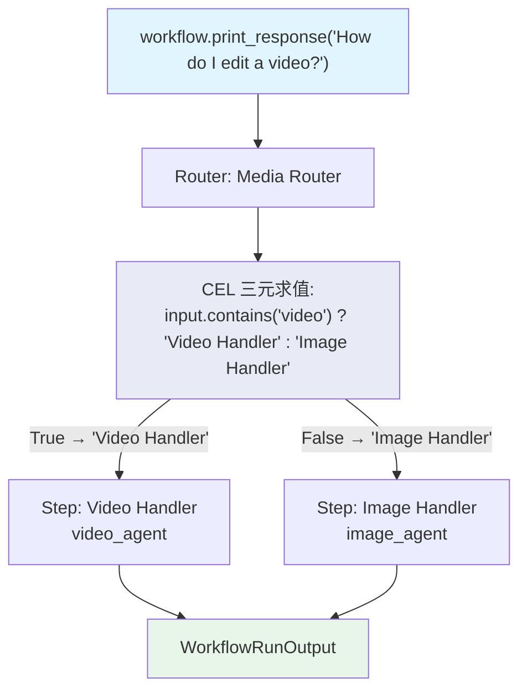

# cel_ternary.py — 实现原理分析

> 源文件：`cookbook/04_workflows/07_cel_expressions/router/cel_ternary.py`

## 概述

本示例展示 Agno Workflow **`Router` 使用 CEL 三元运算符作为 `selector`**：通过 CEL 三元语法 `condition ? "StepA" : "StepB"` 在一行表达式中完成条件路由，返回步骤名称字符串，Router 自动从 `choices` 中查找匹配步骤。

**核心配置一览：**

| 配置项 | 值 | 说明 |
|--------|------|------|
| `selector` 类型 | `str`（CEL 三元表达式） | 替代 Python selector 函数 |
| 三元语法 | `condition ? "step_a" : "step_b"` | 标准 CEL 三元运算符 |
| 返回值 | 步骤名称字符串 | Router 按名称查找 choices |

## 核心组件解析

### CEL 三元 selector

```python
Router(
    name="Media Router",
    selector='input.contains("video") ? "Video Handler" : "Image Handler"',
    choices=[
        Step(name="Video Handler", agent=video_agent),   # CEL 返回 "Video Handler" 时选中
        Step(name="Image Handler", agent=image_agent),   # CEL 返回 "Image Handler" 时选中
    ],
)
```

### 执行逻辑

```
输入: "How do I edit a video for YouTube?"
CEL 求值: input.contains("video") = True → "Video Handler"
Router 查找 choices 中 name="Video Handler" 的步骤 → video_agent Step
执行 video_agent
```

### CEL Router 可用变量

| 变量 | 类型 | 说明 |
|------|------|------|
| `input` | `string` | Workflow 原始输入 |
| `session_state` | `map` | 会话状态 |
| `previous_step_content` | `string` | 前驱步骤输出 |

### 扩展三元变体

```cel
# 多层嵌套三元（CEL 不原生支持，建议用 Condition）
input.contains("video") ? "Video Handler" : input.contains("audio") ? "Audio Handler" : "Image Handler"

# 会话状态路由
session_state["user_type"] == "premium" ? "Premium Handler" : "Standard Handler"

# 前驱内容长度路由
previous_step_content.length() > 1000 ? "Deep Analysis" : "Quick Summary"
```

## Mermaid 流程图



## Python 函数 vs CEL 三元对比

```python
# Python 函数方式（等价逻辑）
def media_selector(step_input: StepInput) -> str:
    if "video" in (step_input.input or "").lower():
        return "Video Handler"
    return "Image Handler"

# CEL 三元方式（一行完成）
selector='input.contains("video") ? "Video Handler" : "Image Handler"'
```

## 关键源码文件索引

| 文件 | 关键类/函数 | 作用 |
|------|------------|------|
| `agno/workflow/router.py` | `Router.selector` L81 | 支持 str 类型 CEL 表达式 |
| `agno/workflow/cel.py` | CEL 上下文和求值器 | 解析三元运算符 |
