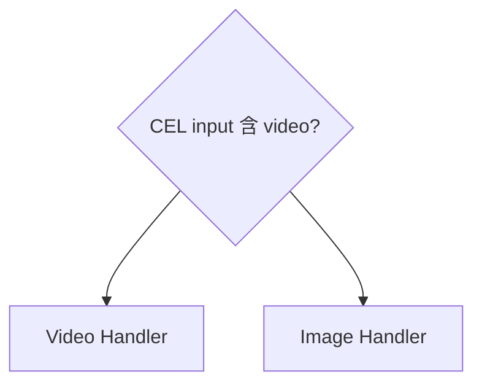

# cel_ternary.py — 实现原理分析

<!-- cookbook-py-source:start -->
## 完整源码

```python
"""Router with CEL expression: ternary operator on input content.
==============================================================

Uses a CEL ternary to pick between two steps based on whether
the input mentions "video" or not.

Requirements:
    pip install cel-python
"""

from agno.agent import Agent
from agno.models.openai import OpenAIChat
from agno.workflow import CEL_AVAILABLE, Step, Workflow
from agno.workflow.router import Router

# ---------------------------------------------------------------------------
# Setup
# ---------------------------------------------------------------------------
if not CEL_AVAILABLE:
    print("CEL is not available. Install with: pip install cel-python")
    exit(1)

# ---------------------------------------------------------------------------
# Create Agents
# ---------------------------------------------------------------------------
video_agent = Agent(
    name="Video Specialist",
    model=OpenAIChat(id="gpt-4o-mini"),
    instructions="You specialize in video content creation and editing advice.",
    markdown=True,
)

image_agent = Agent(
    name="Image Specialist",
    model=OpenAIChat(id="gpt-4o-mini"),
    instructions="You specialize in image design, photography, and visual content.",
    markdown=True,
)

# ---------------------------------------------------------------------------
# Create Workflow
# ---------------------------------------------------------------------------
workflow = Workflow(
    name="CEL Ternary Router",
    steps=[
        Router(
            name="Media Router",
            selector='input.contains("video") ? "Video Handler" : "Image Handler"',
            choices=[
                Step(name="Video Handler", agent=video_agent),
                Step(name="Image Handler", agent=image_agent),
            ],
        ),
    ],
)

# ---------------------------------------------------------------------------
# Run Workflow
# ---------------------------------------------------------------------------
if __name__ == "__main__":
    print("--- Video request ---")
    workflow.print_response(input="How do I edit a video for YouTube?")
    print()

    print("--- Image request ---")
    workflow.print_response(input="Help me design a logo for my startup.")
```

<!-- cookbook-py-source:end -->

> 源文件：`cookbook/04_workflows/07_cel_expressions/router/cel_ternary.py`

## 概述

本示例展示 **CEL 三元选择路由**：`input.contains("video") ? "Video Handler" : "Image Handler"`，`choices` 中 `Step.name` 须与字面量完全一致（`L48-52`）。

**核心配置一览：**

| 配置项 | 值 |
|--------|-----|
| `selector` | `'input.contains("video") ? "Video Handler" : "Image Handler"'` |

## System Prompt 组装

```text
You specialize in video content creation and editing advice.
```

```text
You specialize in image design, photography, and visual content.
```

## Mermaid 流程图


```mermaid
flowchart TD
    Q{"CEL input 含 video?"} --> V["Video Handler"]
    Q --> I["Image Handler"]
```

## 关键源码文件索引

| 文件 | 作用 |
|------|------|
| `agno/workflow/router.py` | CEL 三元 |
