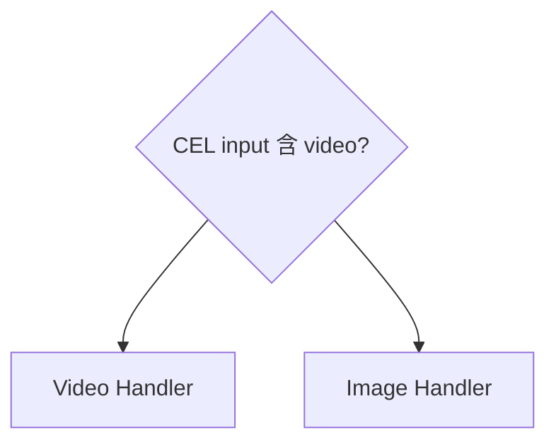

# cel_ternary.py — 实现原理分析

> 源文件：`cookbook/04_workflows/07_cel_expressions/router/cel_ternary.py`

## 概述

本示例展示 **CEL 三元选择路由**：`input.contains("video") ? "Video Handler" : "Image Handler"`，`choices` 中 `Step.name` 须与字面量完全一致（`L48-52`）。

**核心配置一览：**

| 配置项 | 值 |
|--------|-----|
| `selector` | `'input.contains("video") ? "Video Handler" : "Image Handler"'` |

## System Prompt 组装

```text
You specialize in video content creation and editing advice.
```

```text
You specialize in image design, photography, and visual content.
```

## Mermaid 流程图


```mermaid
flowchart TD
    Q{"CEL input 含 video?"} --> V["Video Handler"]
    Q --> I["Image Handler"]
```

## 关键源码文件索引

| 文件 | 作用 |
|------|------|
| `agno/workflow/router.py` | CEL 三元 |
