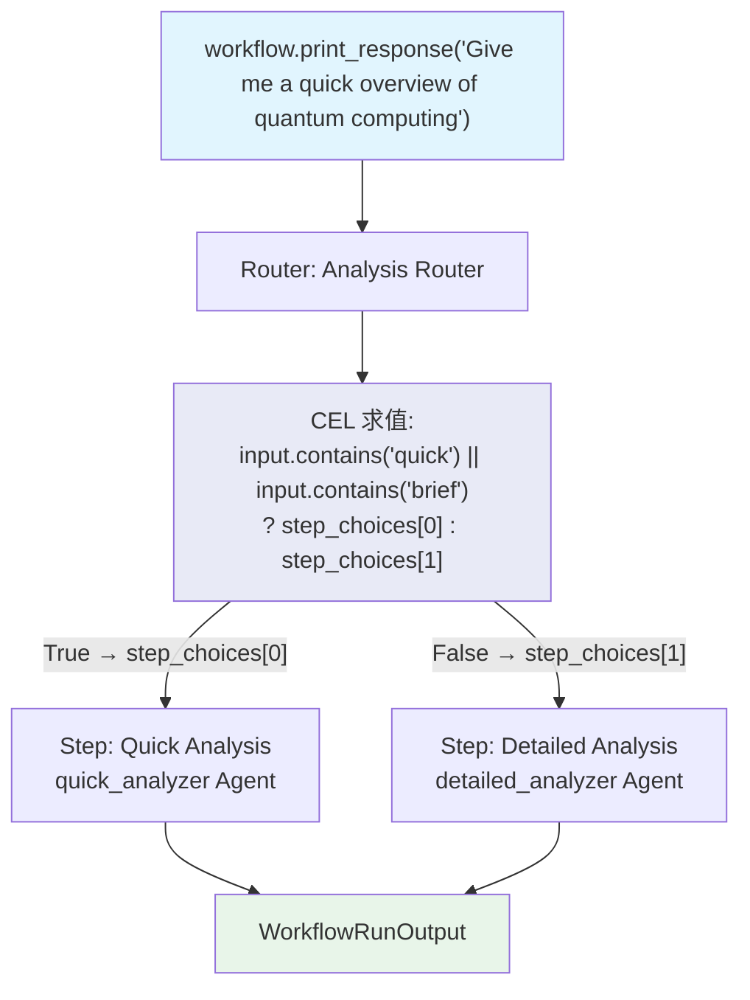

# cel_using_step_choices.py — 实现原理分析

> 源文件：`cookbook/04_workflows/07_cel_expressions/router/cel_using_step_choices.py`

## 概述

本示例展示 Agno Workflow **CEL `selector` 通过 `step_choices[N]` 按索引引用步骤**：CEL 表达式可直接使用 `step_choices[0]`、`step_choices[1]` 等索引访问 `choices` 列表中的步骤对象，避免硬编码步骤名称，提升 CEL 表达式的可维护性。

**核心配置一览：**

| 配置项 | 值 | 说明 |
|--------|------|------|
| `selector` 类型 | `str`（CEL 表达式） | 使用 `step_choices[N]` |
| `step_choices[0]` | `choices[0]`（第一个步骤） | 索引访问 choices |
| 返回类型 | 步骤对象（不是字符串） | Router 直接执行该步骤 |

## 核心组件解析

### CEL step_choices 索引访问

```python
Router(
    name="Analysis Router",
    # step_choices[0] = Step(name="Quick Analysis")
    # step_choices[1] = Step(name="Detailed Analysis")
    selector='input.contains("quick") || input.contains("brief") ? step_choices[0] : step_choices[1]',
    choices=[
        Step(name="Quick Analysis", agent=quick_analyzer),
        Step(name="Detailed Analysis", agent=detailed_analyzer),
    ],
)
```

### 与字符串名称方式对比

```python
# 字符串名称方式（容易拼写错误）
selector='input.contains("quick") ? "Quick Analysis" : "Detailed Analysis"'

# step_choices 索引方式（更安全，不依赖名称拼写）
selector='input.contains("quick") ? step_choices[0] : step_choices[1]'
```

### 索引的语义

| 索引 | 对应 choice | 步骤名 |
|------|-----------|-------|
| `step_choices[0]` | `choices[0]` | "Quick Analysis" |
| `step_choices[1]` | `choices[1]` | "Detailed Analysis" |

## 应用场景

| 场景 | 优势 |
|------|------|
| 步骤名称可能变化时 | 按索引引用不受名称变化影响 |
| 多个 choices 时 | 减少字符串拼写错误 |
| 动态生成 choices 时 | 按位置引用更清晰 |

## Mermaid 流程图



## 关键源码文件索引

| 文件 | 关键类/函数 | 作用 |
|------|------------|------|
| `agno/workflow/router.py` | `Router._run()` | 注入 `step_choices` 到 CEL 上下文 |
| `agno/workflow/cel.py` | CEL 上下文构建 | 提供 `step_choices` 变量 |
