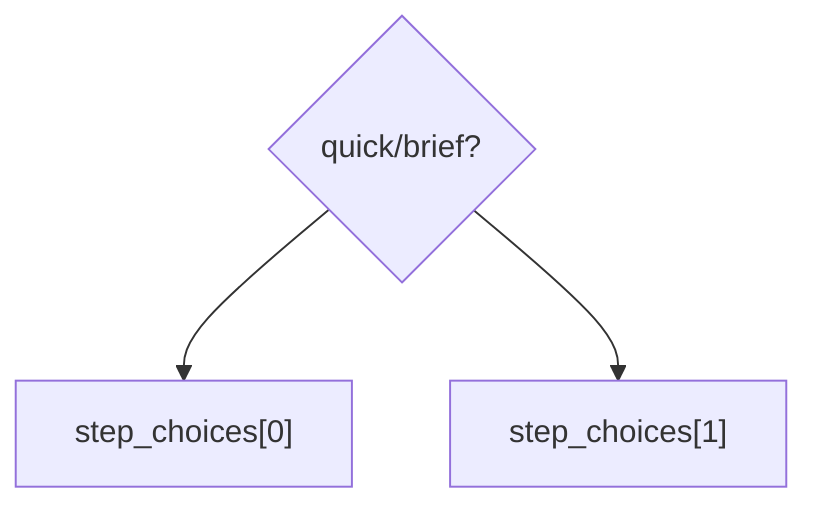

# cel_using_step_choices.py — 实现原理分析

<!-- cookbook-py-source:start -->
## 完整源码

```python
"""Router with CEL: route using step_choices index.
================================================

Uses step_choices[0], step_choices[1], etc. to reference steps by their
position in the choices list, rather than hardcoding step names.

This is useful when you want to:
- Avoid typos in step names
- Make the CEL expression more maintainable
- Reference steps dynamically based on index

Requirements:
    pip install cel-python
"""

from agno.agent import Agent
from agno.models.openai import OpenAIChat
from agno.workflow import CEL_AVAILABLE, Step, Workflow
from agno.workflow.router import Router

# ---------------------------------------------------------------------------
# Setup
# ---------------------------------------------------------------------------
if not CEL_AVAILABLE:
    print("CEL is not available. Install with: pip install cel-python")
    exit(1)

# ---------------------------------------------------------------------------
# Create Agents
# ---------------------------------------------------------------------------
quick_analyzer = Agent(
    name="Quick Analyzer",
    model=OpenAIChat(id="gpt-4o-mini"),
    instructions="Provide a brief, concise analysis of the topic.",
    markdown=True,
)

detailed_analyzer = Agent(
    name="Detailed Analyzer",
    model=OpenAIChat(id="gpt-4o-mini"),
    instructions="Provide a comprehensive, in-depth analysis of the topic.",
    markdown=True,
)

# ---------------------------------------------------------------------------
# Create Workflow
# ---------------------------------------------------------------------------
workflow = Workflow(
    name="CEL Step Choices Router",
    steps=[
        Router(
            name="Analysis Router",
            # step_choices[0] = "Quick Analysis" (first choice)
            # step_choices[1] = "Detailed Analysis" (second choice)
            selector='input.contains("quick") || input.contains("brief") ? step_choices[0] : step_choices[1]',
            choices=[
                Step(name="Quick Analysis", agent=quick_analyzer),
                Step(name="Detailed Analysis", agent=detailed_analyzer),
            ],
        ),
    ],
)

# ---------------------------------------------------------------------------
# Run Workflow
# ---------------------------------------------------------------------------
if __name__ == "__main__":
    # This will route to step_choices[0] ("Quick Analysis")
    print("=== Quick analysis request ===")
    workflow.print_response(
        input="Give me a quick overview of quantum computing.", stream=True
    )

    print("\n" + "=" * 50 + "\n")

    # This will route to step_choices[1] ("Detailed Analysis")
    print("=== Detailed analysis request ===")
    workflow.print_response(input="Explain quantum computing in detail.", stream=True)
```

<!-- cookbook-py-source:end -->

> 源文件：`cookbook/04_workflows/07_cel_expressions/router/cel_using_step_choices.py`

## 概述

本示例展示 **CEL 使用 `step_choices` 下标** 选择分支：`step_choices[0]` / `step_choices[1]` 对应 `choices` 列表顺序，避免在表达式中硬编码易错步名（`L55-58`）。条件为 `input` 含 `quick` 或 `brief` 走快捷分析。

**核心配置一览：**

| 配置项 | 值 |
|--------|-----|
| `selector` | `'input.contains("quick") \|\| input.contains("brief") ? step_choices[0] : step_choices[1]'` |

## 运行机制与因果链

`step_choices` 由框架注入 Router 的 CEL 上下文（见 `router.py` 文档 `L57-L63`）。

## System Prompt 组装

```text
Provide a brief, concise analysis of the topic.
```

```text
Provide a comprehensive, in-depth analysis of the topic.
```

## Mermaid 流程图


```mermaid
flowchart TD
    C{"quick/brief?"} --> Q["step_choices[0]"]
    C --> D["step_choices[1]"]
```

## 关键源码文件索引

| 文件 | 作用 |
|------|------|
| `agno/workflow/router.py` | `step_choices` CEL 变量 |
