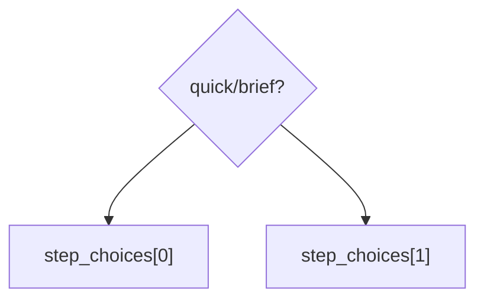

# cel_using_step_choices.py — 实现原理分析

> 源文件：`cookbook/04_workflows/07_cel_expressions/router/cel_using_step_choices.py`

## 概述

本示例展示 **CEL 使用 `step_choices` 下标** 选择分支：`step_choices[0]` / `step_choices[1]` 对应 `choices` 列表顺序，避免在表达式中硬编码易错步名（`L55-58`）。条件为 `input` 含 `quick` 或 `brief` 走快捷分析。

**核心配置一览：**

| 配置项 | 值 |
|--------|-----|
| `selector` | `'input.contains("quick") \|\| input.contains("brief") ? step_choices[0] : step_choices[1]'` |

## 运行机制与因果链

`step_choices` 由框架注入 Router 的 CEL 上下文（见 `router.py` 文档 `L57-L63`）。

## System Prompt 组装

```text
Provide a brief, concise analysis of the topic.
```

```text
Provide a comprehensive, in-depth analysis of the topic.
```

## Mermaid 流程图


```mermaid
flowchart TD
    C{"quick/brief?"} --> Q["step_choices[0]"]
    C --> D["step_choices[1]"]
```

## 关键源码文件索引

| 文件 | 作用 |
|------|------|
| `agno/workflow/router.py` | `step_choices` CEL 变量 |
