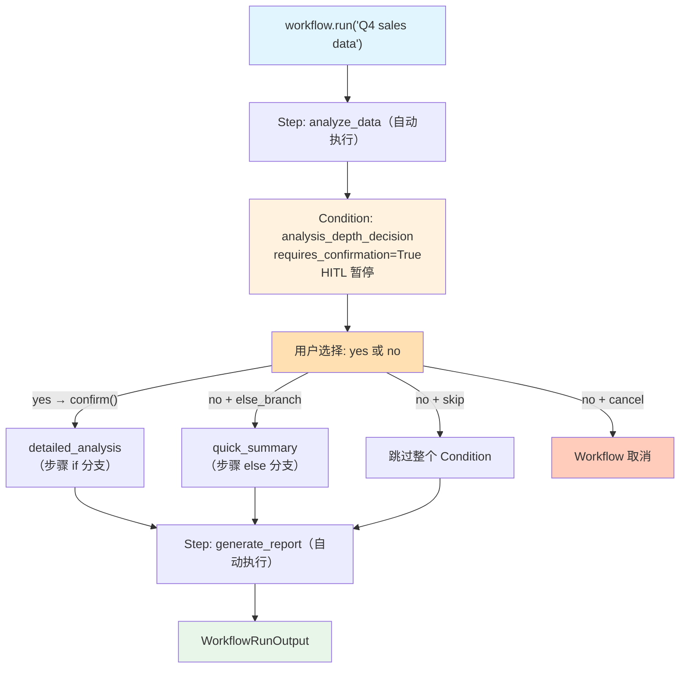

# 01_condition_user_decision.py — 实现原理分析

> 源文件：`cookbook/04_workflows/_07_human_in_the_loop/condition/01_condition_user_decision.py`

## 概述

本示例展示 Agno Workflow **`Condition` 的 HITL 用户决策**机制：通过 `Condition(requires_confirmation=True)` 使 Condition 本身变为 HITL 决策点，用户的确认/拒绝决定执行 `steps`（if 分支）还是 `else_steps`（else 分支）或其他行为，`on_reject` 参数支持三种拒绝策略。

**核心配置一览：**

| `on_reject` 值 | 拒绝时行为 |
|---------------|---------|
| `OnReject.else_branch`（默认） | 执行 `else_steps` |
| `OnReject.skip` | 跳过整个 Condition |
| `OnReject.cancel` | 取消整个 Workflow |

## 核心组件解析

### Condition HITL 配置

```python
from agno.workflow.types import OnReject

analysis_condition = Condition(
    name="analysis_depth_decision",
    steps=[Step(name="detailed_analysis", executor=detailed_analysis)],   # 确认后执行
    else_steps=[Step(name="quick_summary", executor=quick_summary)],      # 拒绝后执行
    requires_confirmation=True,
    confirmation_message="Would you like to perform detailed analysis?",
    on_reject=OnReject.else_branch,  # 拒绝时执行 else_steps
)
```

### 三种拒绝模式演示

```python
# 模式 1: on_reject='else' → 执行 quick_summary（else_steps）
Condition(..., on_reject=OnReject.else_branch)

# 模式 2: on_reject='skip' → 跳过整个 Condition（包括 else_steps）
Condition(..., on_reject=OnReject.skip)

# 模式 3: on_reject='cancel' → 取消 Workflow
Condition(..., on_reject=OnReject.cancel)
```

### HITL 交互处理

```python
run_output = workflow.run("Q4 sales data")

while run_output.is_paused:
    for requirement in run_output.steps_requiring_confirmation:
        print(f"[DECISION POINT] {requirement.confirmation_message}")
        print(f"[INFO] on_reject mode: {requirement.on_reject}")

        if input("Your choice (yes/no): ").lower() in ("yes", "y"):
            requirement.confirm()  # → 执行 steps（detailed_analysis）
        else:
            requirement.reject()   # → 根据 on_reject 决定行为

    run_output = workflow.continue_run(run_output)
```

## 三种拒绝结果对比

| 操作 | else_branch | skip | cancel |
|------|------------|------|--------|
| 确认 (yes) | detailed_analysis | detailed_analysis | detailed_analysis |
| 拒绝 (no) | quick_summary | 跳过（直接到 report） | Workflow 取消 |
| 后续步骤 | generate_report | generate_report | 无 |

## Mermaid 流程图



## 关键源码文件索引

| 文件 | 关键类/函数 | 作用 |
|------|------------|------|
| `agno/workflow/condition.py` | `Condition.requires_confirmation` | 启用 Condition HITL |
| `agno/workflow/types.py` | `OnReject` | 拒绝行为枚举（else_branch/skip/cancel） |
| `agno/workflow/workflow.py` | `Workflow.continue_run()` | 用户响应后继续 |
