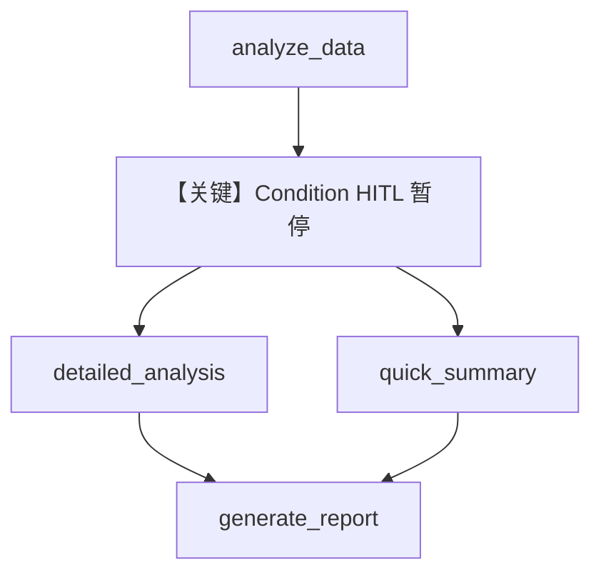

# 01_condition_user_decision.py — 实现原理分析

> 源文件：`cookbook/04_workflows/_07_human_in_the_loop/condition/01_condition_user_decision.py`

## 概述

本示例展示 **`Condition.requires_confirmation=True` 的人机协同分支**：执行前暂停，由用户确认走 `steps`（详细分析）或拒绝；`on_reject` 取 `else` / `skip` / `cancel` 控制拒绝后行为（文件头注释 `L7-L17`）。`evaluator` 在 HITL 模式下可被忽略（见 `condition.py` `L81` 注释）。

**核心配置一览：**

| 配置项 | 说明 |
|--------|------|
| `Condition` | `requires_confirmation=True`，`on_reject` 多模式演示 |
| `SqliteDb` | 暂停会话持久化 |
| 步骤 | `analyze_data` → Condition → `detailed_analysis` / `quick_summary` → `generate_report` |

## 核心组件解析

### run_demo

`L71+`：按 `on_reject_mode` 构造不同 `Condition` 并运行，展示交互差异。

### 运行机制与因果链

1. **数据路径**：分析步输出 → 暂停 → 用户选择 → 对应分支 → 报告步。
2. **副作用**：DB 存暂停状态；`agno/workflow/utils/hitl.py` 参与恢复。

## System Prompt 组装

无单一 LLM Agent；输出为 `StepOutput.content` 固定字符串（`L30-68`）。若需「还原 system」，不适用；用户确认文案由运行时 CLI/OS 注入。

## 完整 API 请求

无标准 Chat 调用；暂停与恢复由 AgentOS/CLI 层处理。

## Mermaid 流程图

```mermaid
flowchart TD
    A["analyze_data"] --> P["【关键】Condition HITL 暂停"]
    P --> D["detailed_analysis"]
    P --> Q["quick_summary"]
    D --> R["generate_report"]
    Q --> R
```

## 关键源码文件索引

| 文件 | 作用 |
|------|------|
| `agno/workflow/condition.py` | `requires_confirmation` L95-99 |
| `agno/workflow/utils/hitl.py` | 暂停/恢复辅助 |
