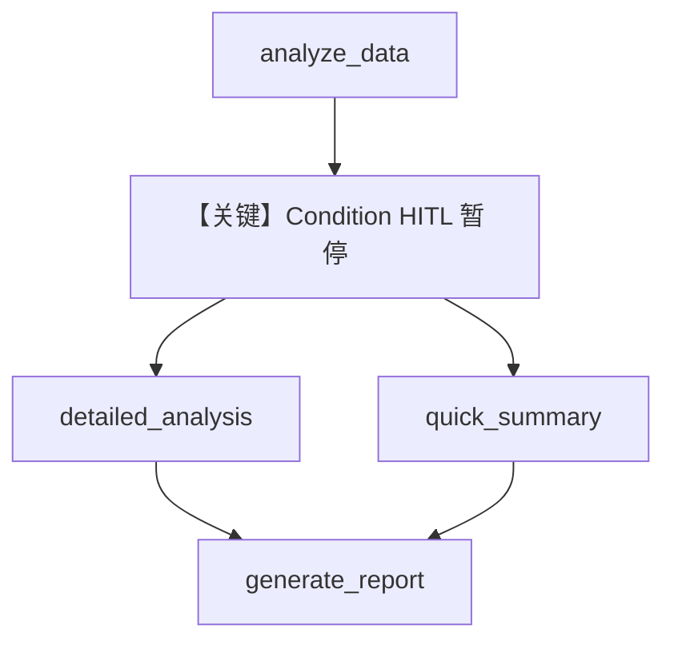

# 01_condition_user_decision.py — 实现原理分析

<!-- cookbook-py-source:start -->
## 完整源码

```python
"""
Condition with User Decision HITL Example

This example demonstrates how to use HITL with a Condition component,
allowing the user to decide which branch to execute at runtime.

When `requires_confirmation=True` on a Condition, the `on_reject` setting
controls what happens when the user rejects:

- on_reject="else" (default): Execute `else_steps` if provided, otherwise skip
- on_reject="skip": Skip the entire condition (both branches)
- on_reject="cancel": Cancel the workflow

This is useful for:
- User-driven decision points
- Interactive branching workflows
- A/B testing with human judgment
"""

from agno.db.sqlite import SqliteDb
from agno.workflow.condition import Condition
from agno.workflow.step import Step
from agno.workflow.types import OnReject, StepInput, StepOutput
from agno.workflow.workflow import Workflow


# ============================================================
# Step functions
# ============================================================
def analyze_data(step_input: StepInput) -> StepOutput:
    """Analyze the data."""
    user_query = step_input.input or "data"
    return StepOutput(
        content=f"Analysis complete for '{user_query}':\n"
        "- Found potential issues that may require detailed review\n"
        "- Quick summary is available\n\n"
        "Would you like to proceed with detailed analysis?"
    )


def detailed_analysis(step_input: StepInput) -> StepOutput:
    """Perform detailed analysis (if branch)."""
    return StepOutput(
        content="Detailed Analysis Results:\n"
        "- Comprehensive review completed\n"
        "- All edge cases examined\n"
        "- Full report generated\n"
        "- Processing time: 10 minutes"
    )


def quick_summary(step_input: StepInput) -> StepOutput:
    """Provide quick summary (else branch)."""
    return StepOutput(
        content="Quick Summary:\n"
        "- Basic metrics computed\n"
        "- Key highlights identified\n"
        "- Processing time: 1 minute"
    )


def generate_report(step_input: StepInput) -> StepOutput:
    """Generate final report."""
    previous_content = step_input.previous_step_content or "No analysis"
    return StepOutput(
        content=f"=== FINAL REPORT ===\n\n{previous_content}\n\n"
        "Report generated successfully."
    )


def run_demo(on_reject_mode: OnReject, demo_name: str):
    """Run a demo with the specified on_reject mode."""
    print("\n" + "=" * 60)
    print(f"Demo: {demo_name}")
    print(f"on_reject = {on_reject_mode.value}")
    print("=" * 60)

    # Define the steps
    analyze_step = Step(name="analyze_data", executor=analyze_data)

    # Condition with HITL - user decides which branch to take
    # The evaluator is ignored when requires_confirmation=True
    # User confirms -> detailed_analysis (if branch)
    # User rejects -> behavior depends on on_reject setting
    analysis_condition = Condition(
        name="analysis_depth_decision",
        steps=[Step(name="detailed_analysis", executor=detailed_analysis)],
        else_steps=[Step(name="quick_summary", executor=quick_summary)],
        requires_confirmation=True,
        confirmation_message="Would you like to perform detailed analysis?",
        on_reject=on_reject_mode,
    )

    report_step = Step(name="generate_report", executor=generate_report)

    # Create workflow with database for HITL persistence
    workflow = Workflow(
        name="condition_hitl_demo",
        steps=[analyze_step, analysis_condition, report_step],
        db=SqliteDb(db_file="tmp/condition_hitl.db"),
    )

    run_output = workflow.run("Q4 sales data")

    # Handle HITL pauses
    while run_output.is_paused:
        # Handle Step requirements (confirmation)
        for requirement in run_output.steps_requiring_confirmation:
            print(f"\n[DECISION POINT] {requirement.step_name}")
            print(f"[HITL] {requirement.confirmation_message}")
            print(f"[INFO] on_reject mode: {requirement.on_reject}")

            user_choice = input("\nYour choice (yes/no): ").strip().lower()
            if user_choice in ("yes", "y"):
                requirement.confirm()
                print("[HITL] Confirmed - executing 'if' branch (detailed analysis)")
            else:
                requirement.reject()
                if on_reject_mode == OnReject.else_branch:
                    print("[HITL] Rejected - executing 'else' branch (quick summary)")
                elif on_reject_mode == OnReject.skip:
                    print("[HITL] Rejected - skipping entire condition")
                else:
                    print("[HITL] Rejected - cancelling workflow")

        run_output = workflow.continue_run(run_output)

    print("\n" + "-" * 40)
    print(f"Status: {run_output.status}")
    print("-" * 40)
    print(run_output.content)


if __name__ == "__main__":
    print("=" * 60)
    print("Condition with User Decision HITL Example")
    print("=" * 60)
    print("\nThis demo shows 3 different on_reject behaviors:")
    print("  1. on_reject='else' (default) - Execute else branch on reject")
    print("  2. on_reject='skip' - Skip entire condition on reject")
    print("  3. on_reject='cancel' - Cancel workflow on reject")
    print()

    # Let user choose which demo to run
    print("Which demo would you like to run?")
    print("  1. on_reject='else' (execute else branch)")
    print("  2. on_reject='skip' (skip condition)")
    print("  3. on_reject='cancel' (cancel workflow)")
    print("  4. Run all demos")

    choice = input("\nEnter choice (1-4): ").strip()

    if choice == "1":
        run_demo(OnReject.else_branch, "Execute Else Branch on Reject")
    elif choice == "2":
        run_demo(OnReject.skip, "Skip Condition on Reject")
    elif choice == "3":
        run_demo(OnReject.cancel, "Cancel Workflow on Reject")
    elif choice == "4":
        # Run all demos - use a non-interactive mode for demonstration
        print(
            "\nRunning all demos with automatic 'no' response to show rejection behavior..."
        )

        for mode, name in [
            (OnReject.else_branch, "Execute Else Branch on Reject"),
            (OnReject.skip, "Skip Condition on Reject"),
            (OnReject.cancel, "Cancel Workflow on Reject"),
        ]:
            print("\n" + "=" * 60)
            print(f"Demo: {name}")
            print(f"on_reject = {mode.value}")
            print("=" * 60)

            analyze_step = Step(name="analyze_data", executor=analyze_data)
            analysis_condition = Condition(
                name="analysis_depth_decision",
                evaluator=True,
                steps=[Step(name="detailed_analysis", executor=detailed_analysis)],
                else_steps=[Step(name="quick_summary", executor=quick_summary)],
                requires_confirmation=True,
                confirmation_message="Would you like to perform detailed analysis?",
                on_reject=mode,
            )
            report_step = Step(name="generate_report", executor=generate_report)

            workflow = Workflow(
                name="condition_hitl_demo",
                steps=[analyze_step, analysis_condition, report_step],
                db=SqliteDb(db_file="tmp/condition_hitl.db"),
            )

            run_output = workflow.run("Q4 sales data")

            # Auto-reject for demonstration
            while run_output.is_paused:
                for requirement in run_output.steps_requiring_confirmation:
                    print(f"\n[DECISION POINT] {requirement.step_name}")
                    print(f"[HITL] {requirement.confirmation_message}")
                    print("[AUTO] Rejecting to demonstrate on_reject behavior...")
                    requirement.reject()

                run_output = workflow.continue_run(run_output)

            print(f"\nStatus: {run_output.status}")
            print(f"Content: {run_output.content}")
    else:
        print("Invalid choice. Running default demo (on_reject='else')...")
        run_demo(OnReject.else_branch, "Execute Else Branch on Reject")
```

<!-- cookbook-py-source:end -->

> 源文件：`cookbook/04_workflows/_07_human_in_the_loop/condition/01_condition_user_decision.py`

## 概述

本示例展示 **`Condition.requires_confirmation=True` 的人机协同分支**：执行前暂停，由用户确认走 `steps`（详细分析）或拒绝；`on_reject` 取 `else` / `skip` / `cancel` 控制拒绝后行为（文件头注释 `L7-L17`）。`evaluator` 在 HITL 模式下可被忽略（见 `condition.py` `L81` 注释）。

**核心配置一览：**

| 配置项 | 说明 |
|--------|------|
| `Condition` | `requires_confirmation=True`，`on_reject` 多模式演示 |
| `SqliteDb` | 暂停会话持久化 |
| 步骤 | `analyze_data` → Condition → `detailed_analysis` / `quick_summary` → `generate_report` |

## 核心组件解析

### run_demo

`L71+`：按 `on_reject_mode` 构造不同 `Condition` 并运行，展示交互差异。

### 运行机制与因果链

1. **数据路径**：分析步输出 → 暂停 → 用户选择 → 对应分支 → 报告步。
2. **副作用**：DB 存暂停状态；`agno/workflow/utils/hitl.py` 参与恢复。

## System Prompt 组装

无单一 LLM Agent；输出为 `StepOutput.content` 固定字符串（`L30-68`）。若需「还原 system」，不适用；用户确认文案由运行时 CLI/OS 注入。

## 完整 API 请求

无标准 Chat 调用；暂停与恢复由 AgentOS/CLI 层处理。

## Mermaid 流程图


```mermaid
flowchart TD
    A["analyze_data"] --> P["【关键】Condition HITL 暂停"]
    P --> D["detailed_analysis"]
    P --> Q["quick_summary"]
    D --> R["generate_report"]
    Q --> R
```

## 关键源码文件索引

| 文件 | 作用 |
|------|------|
| `agno/workflow/condition.py` | `requires_confirmation` L95-99 |
| `agno/workflow/utils/hitl.py` | 暂停/恢复辅助 |
