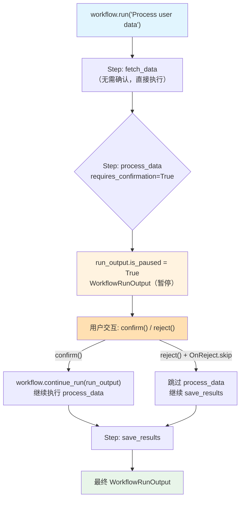

# 01_basic_step_confirmation.py — 实现原理分析

> 源文件：`cookbook/04_workflows/_07_human_in_the_loop/confirmation/01_basic_step_confirmation.py`

## 概述

本示例展示 Agno Workflow **Human-in-the-Loop（HITL）步骤确认**机制：通过 `Step(requires_confirmation=True)` 使工作流在执行特定步骤前暂停，等待用户确认或拒绝，支持 `OnReject.skip`（跳过步骤继续）和 `OnReject.cancel`（取消整个工作流）。

**核心配置一览：**

| 配置项 | 值 | 说明 |
|--------|------|------|
| `Step.requires_confirmation` | `True` | 启用步骤确认暂停 |
| `Step.confirmation_message` | 自定义提示文本 | 显示给用户的确认消息 |
| `Step.on_reject` | `OnReject.skip` / `OnReject.cancel` | 拒绝时行为 |
| `run_output.is_paused` | `bool` | 检查是否处于暂停状态 |
| `Workflow.db` | `SqliteDb` | HITL 必须配置数据库 |

## 核心组件解析

### 配置需要确认的步骤

```python
from agno.workflow import OnReject

workflow = Workflow(
    name="data_processing",
    db=SqliteDb(db_file="tmp/workflow_hitl.db"),  # HITL 必须有 db
    steps=[
        Step(name="fetch_data", agent=fetch_agent),
        Step(
            name="process_data",
            agent=process_agent,
            requires_confirmation=True,                        # 暂停等待确认
            confirmation_message="About to process sensitive data. Confirm?",
            on_reject=OnReject.skip,  # 拒绝时跳过此步骤继续
        ),
        Step(name="save_results", agent=save_agent),
    ],
)
```

### HITL 交互循环

```python
run_output = workflow.run("Process user data")

if run_output.is_paused:
    for requirement in run_output.steps_requiring_confirmation:
        print(f"Step '{requirement.step_name}' requires confirmation")
        print(f"Message: {requirement.confirmation_message}")

        user_input = input("Do you want to continue? (yes/no): ").strip().lower()

        if user_input in ("yes", "y"):
            requirement.confirm()   # 确认执行
        else:
            requirement.reject()    # 拒绝（根据 on_reject 决定行为）

    # 继续工作流
    run_output = workflow.continue_run(run_output)

print(f"Final output: {run_output.content}")
```

### OnReject 行为对比

| `on_reject` 值 | 行为 | 适用场景 |
|--------------|------|---------|
| `OnReject.cancel`（默认） | 取消整个工作流 | 步骤不可跳过时 |
| `OnReject.skip` | 跳过此步骤，继续后续 | 步骤可选时 |

## Mermaid 流程图



## 关键源码文件索引

| 文件 | 关键类/函数 | 作用 |
|------|------------|------|
| `agno/workflow/step.py` | `Step.requires_confirmation` | 启用确认暂停 |
| `agno/workflow/types.py` | `OnReject` | 拒绝行为枚举 |
| `agno/workflow/workflow.py` | `Workflow.continue_run()` | 用户响应后继续执行 |
| `agno/workflow/types.py` | `WorkflowRunOutput.is_paused` | 检查暂停状态 |
| `agno/workflow/types.py` | `StepRequirement.confirm()/reject()` | 用户确认/拒绝接口 |
